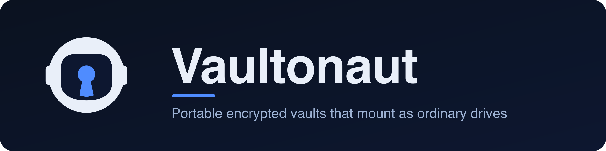

<p align="center">
  
</p>

Vaultonaut creates portable, password-protected encrypted vaults and mounts them as ordinary drives. Once a vault is unlocked it behaves like any other disk: you open, edit, and save files with any application, and every read and write is encrypted and decrypted on the fly. Nothing is ever written to the vault in the clear.

A vault is a self-contained folder. Copy that folder to another computer, an external drive, or a cloud-sync folder and it opens anywhere with its password — on macOS, Windows, or Linux.

## Table of Contents

- [How it works](#how-it-works)
- [Requirements](#requirements)
- [Setup](#setup)
- [Verifying your download](#verifying-your-download)
  - [Checking for updates](#checking-for-updates)
- [Quick start](#quick-start)
- [The web interface](#the-web-interface)
- [Desktop app](#desktop-app)
- [How new versions are published](#how-new-versions-are-published)
- [Starting automatically at login](#starting-automatically-at-login)
- [Where your data lives](#where-your-data-lives)
- [External drives](#external-drives)
- [Commands](#commands)
- [Running a project from a vault](#running-a-project-from-a-vault)
- [Security](#security)
  - [What a vault protects, and what it cannot](#what-a-vault-protects-and-what-it-cannot)
  - [An open format, not home-grown cryptography](#an-open-format-not-home-grown-cryptography)
- [Keys and recovery](#keys-and-recovery)
  - [Secure notes](#secure-notes)
  - [Finding files by name](#finding-files-by-name)
  - [Read-only access and sharing](#read-only-access-and-sharing)
  - [Viewing files in the app](#viewing-files-in-the-app)
- [Team vaults](#team-vaults)
- [Per-vault decoy protection (advanced)](#per-vault-decoy-protection-advanced)
- [Travel mode](#travel-mode)
- [Keeping vaults intact](#keeping-vaults-intact)
  - [Self-healing](#self-healing)
- [Vaults that live in the cloud](#vaults-that-live-in-the-cloud)
- [Backing up off-site](#backing-up-off-site)
  - [Version history](#version-history)
- [Mirroring across places](#mirroring-across-places)
  - [Reaching a vault on another machine](#reaching-a-vault-on-another-machine)
- [Splitting a vault across places](#splitting-a-vault-across-places)
- [Emergency and inheritance access](#emergency-and-inheritance-access)
  - [A dead-man's switch](#a-dead-mans-switch)
- [Locking](#locking)
  - [Securely removing a vault](#securely-removing-a-vault)
- [Tamper detection](#tamper-detection)
  - [The automatic check](#the-automatic-check)
  - [Deep content check](#deep-content-check)
  - [Sealing a vault (a strict tripwire)](#sealing-a-vault-a-strict-tripwire)
  - [Tamper history](#tamper-history)
  - [Rollback protection](#rollback-protection)
  - [Vault identity](#vault-identity)
  - [What each layer covers](#what-each-layer-covers)
  - [Timestamped proof](#timestamped-proof)
  - [Portable proof](#portable-proof)
- [Permissions](#permissions)
- [Frequently asked questions](#frequently-asked-questions)
- [Troubleshooting](#troubleshooting)
- [License](#license)

## How it works

Each vault is a folder containing a small `vault.json` description and a `data` directory that holds your files with their names and contents encrypted. When you mount a vault, the operating system shows you a normal drive; behind it, files are encrypted on their way to disk and decrypted on their way back. When you unmount, the drive disappears and only the encrypted folder remains.

Decryption happens only in memory. A mounted vault behaves like an ordinary drive — you can play media, edit files, and run apps — but no decrypted copy of your data is ever written to the persistent disk. Reads are decrypted on the fly, and the small buffer that lets applications rewrite files in place is kept in a RAM disk. So a vault stays "always encrypted" on disk while still working like a real drive, with nothing to turn on.

The in-memory buffer works out of the box on macOS and Linux. On Windows it needs a RAM-disk driver. Without one, a vault still opens and streams, and still writes nothing to disk — only in-place edits and media playback need the driver.

The heavy lifting is done by a bundled encryption engine and a small mount driver that plugs into the operating system (installed once for your platform — see Requirements). You never handle keys directly, and your password is never stored — it is asked for when you create or unlock a vault and used only to derive the encryption key in memory.

## Requirements

Node.js 24.7 or newer, for the command-line and from-source install described below. The desktop app bundles its own runtime, so it needs no separate Node install (see [Desktop app](#desktop-app)). Every feature works on this version, including the post-quantum protection on anything sealed to a person's public key — emergency access, a sealed read share, a team member's access, and an owner-recovery trustee share.

A mount driver appropriate to your system. This is the one component that cannot be bundled, because mounting a drive is done by the operating system. Vaultonaut detects whether it is present and tells you exactly what to install if it is not:

- macOS — FUSE-T (needs no kernel extension and no reboot). It is strongly recommended and, for Finder copies, effectively required. It is safe to keep alongside macFUSE if you already use that for other apps.
- Windows — WinFsp (a single signed installer).
- Linux — FUSE, which ships with virtually every distribution (`fuse3`).

The encryption engine itself downloads automatically the first time you use Vaultonaut. Each release pins a specific, tested engine version, and the download is checked against a SHA-256 checksum shipped inside Vaultonaut before it is used, so a corrupted or tampered binary is never run. In the web interface this first download runs in the background. The page shows a brief "Setting up the encryption engine…" note and refreshes itself the moment the engine is ready. When you update Vaultonaut, it updates the bundled engine to the version tested with that release. There is nothing else to install by hand.

**Windows, one optional extra.** A vault opens and works on Windows with WinFsp alone — you can create, mount, copy files in and out, and read them. What WinFsp alone does not give you is *in-place* writing (a database or a disk-image file that an app rewrites while it is open, and smooth media scrubbing), because that needs a small in-memory work area and Windows has no built-in RAM disk. To enable it, install the ImDisk virtual-disk driver, which puts an `imdisk` command on your PATH; Vaultonaut then uses it automatically on the next mount.

ImDisk is a third-party kernel driver, so its installer needs administrator rights. On a locked-down machine — or a virtual machine with Secure Boot or driver-signature enforcement — it may refuse to load. The vault then simply keeps working in streaming mode, and Vaultonaut says so plainly when it falls back. macOS and Linux need none of this: the in-memory work area is built in there.

Windows also limits most programs to 260-character paths by default. A vault with very long, deeply nested file names can exceed that during whole-vault operations like packing or backup. If you hit a path-length error, turn on long-path support once (the built-in `LongPathsEnabled` setting, via Windows settings or group policy), or keep the vault nearer the top of a drive. Everyday use through the mounted drive is unaffected.

If a mount driver is missing, Vaultonaut can fetch and launch the right installer for your system for you:

```
node vaultonaut.js install-driver
```

This downloads the official, checksum-verified driver installer (FUSE-T on macOS, WinFsp on Windows) and opens it; on Linux it prints the one package command to run. The web interface offers the same as a button.

## Setup

Install dependencies and download the engine:

```
npm install
npm run setup
```

Check that everything is ready:

```
node vaultonaut.js doctor
```

The doctor reports whether the engine and a mount driver are present, and if a driver is missing it prints the exact command or link to install it. It also runs a short integrity self-check that looks over the install's own setup and gives each finding a plain-language fix. Among its checks, it confirms that:

- the data folder is writable, and files holding secrets are private to you;
- every vault you have registered still exists;
- the bundled engine still matches the version and checksum it was verified against;
- the disk holding your vaults is not nearly full, and the system clock looks right;
- no crash left a vault mounted.

The same self-check runs when the web interface starts, and the web page shows any findings at the top until they are resolved. On a healthy install it reports that everything passed and shows nothing.

## Verifying your download

Because this is a security tool, it is worth confirming that the copy you have is the genuine, unmodified release and not a version someone has altered. Each release is signed with the maintainer's private key, and you verify it against the matching public key. The public key never changes between releases, so record it once from a source you trust.

Official signing public key:

```
9ff32decec703dc708275a1b19c62a989ab9e8def96e617add3221322250d550
```

The strongest check uses that key. Run the bundled verifier from the folder you downloaded, passing the key you copied from above:

```
node verify.js . --pubkey <the public key above>
```

This works for both the standalone download and the desktop app. The desktop app carries the same signed manifest inside its bundled application folder (on macOS, that is `Vaultonaut.app/Contents/Resources/app`), so pointing the verifier at that folder confirms an installed copy the same way. The desktop app also runs this check itself each time it starts, described at the end of this section.

The verifier prints one of three results:

- `GENUINE` — every file matches what the maintainer signed.
- `TAMPERED` — a file was changed, is missing, or was added, so you should not run the copy.
- `UNVERIFIED` — the copy carries no signed manifest, which is what an unsigned source checkout (or a build made before release signing was set up) looks like. This is not proof of tampering, but it is also not proof of authenticity, so obtain a signed release if you need that assurance.

The verifier needs only a standard Node.js install: no dependencies, no network, and no password.

If you leave off `--pubkey`, the verifier falls back to the key embedded in the copy itself. That confirms the copy is internally consistent, but it cannot prove the copy came from the maintainer, so prefer the key from this README.

A signed release also includes a plain `SHA256SUMS` file, if you prefer the familiar `sha256sum -c` flow to confirm the files are not corrupted. A checksum on its own only proves a file was not corrupted. The signature is what proves it came from the maintainer. So always run the signature check with `verify.js`, and always take the public key from a source you trust rather than from the download itself.

One limit worth stating plainly: the signature covers the application's own files. It does not cover the third-party packages under `node_modules`, which each machine installs on its own, or the program runtime bundled inside the desktop app. That runtime is the official Node.js build, fixed to a specific version by each release and fetched by the build's own verified toolchain, so a single signature can cover the identical application files on every platform.

As a second layer, the application also checks its own files against that signed manifest each time it starts, and the web page surfaces a warning if they do not match. You can run that same check any time with `vdisk verify-self`. It reports GENUINE when every signed file matches, or ALTERED (listing the files) when one does not. Run from source rather than a signed release, it simply tells you the copy is unsigned and points you back to verifying your download. This is a helpful backstop, not a substitute for the check above: whoever could alter the files could also disable this internal check, which is exactly why verifying your download against a key you obtained independently is the reliable test.

### Checking for updates

You can check whether a newer version has been published with `vdisk update-check`, or with **Check now** next to **Version** in **Settings**. The check only reads the latest published version number and compares it to the copy you are running. It never downloads or installs anything. Getting the update stays your choice, and any download you then make is verified with the signature check above before you trust it.

Automatic checking is turned off by default, on purpose. A check reaches out over the network, so nothing contacts the release page unless you ask it to. If you want a gentle reminder, turn on **Check for updates** in **Settings** and the app will look once a day and show a quiet note when a newer version exists. You can turn it back off at any time. The check reads only a version number and sends nothing about your machine or your vaults.

## Quick start

Create a vault, mount it, use it, and unmount it:

```
node vaultonaut.js create Personal
node vaultonaut.js mount Personal
```

You are asked for a password when creating, and again when mounting. The vault appears as a drive under your home folder in `Vaultonaut`. Work with it like any other disk, then unmount:

```
node vaultonaut.js unmount Personal
```

A bare name such as `Personal` is stored in the vaults folder inside your per-user data directory (see "Where your data lives" below), keeping all your vaults together in one place. You can also give a full path to store a vault wherever you like, including on an external drive.

To start from files you already have, `node vaultonaut.js import <folder>` (or **Import an existing folder** in the web create form) creates a new vault and copies that folder's contents into it, encrypting them on the way in. Your originals are left untouched — delete them yourself once you have confirmed the vault opens and holds everything.

## The web interface

Vaultonaut includes a small local web interface for people who prefer buttons to commands. Start it with:

```
npm start
```

Then open `http://localhost:7420` in your browser.

For everyday use, the page lists your vaults and shows which are mounted. From there you can:

- Manage vaults — create, mount, unmount, reveal, add, and remove them.
- Star your favorites — mark the vaults you use most with the star and they sort to the top of the list. A favorite that has Touch ID, Windows Hello, or a security key enrolled also gets a one-tap unlock. Vaults are still never mounted on their own; a favorite only shortens the unlock you choose to do.
- Add files with progress — while a vault is mounted, files stream straight in with a progress bar. This also sidesteps a copy bug that some macOS driver versions have with large files.
- Check storage use — see how much space a vault's contents take. It is shown only while the vault is open, so an unmounted vault never reveals its size.
- Choose a theme — light, dark, or a calm sepia, or follow your system. The page also works on a phone, where the side menu folds into a slide-out drawer. The phone viewer for a shared vault carries the same theme choices in its own toggle.
- Open the built-in guide — the **Help** button on the navigation rail, or just the `/` key, opens this whole guide inside the app. Search it and step through the matches, or use the "Jump to" bar. It lists the sections that mention your term, busiest first, so one click takes you where the topic is covered most. If an exact phrase finds nothing, the search falls back to matching any of your words, so a near miss still surfaces the right sections.

Nearly everything the command line can do is also here, grouped per vault:

- **Keys** — change a vault's password and manage its keys (recovery keys, Touch ID / Windows Hello, read-only passwords, and read links).
- **Protect** — the tamper check, self-healing recovery data, and backups, each covered in its own section below.
- **Spread** — mirror a vault, serve it as a node, or split it across places, again covered below.

Global options and one-off maintenance live together in the **Settings** panel on the navigation rail: an idle auto-lock, lock-on-sleep, auto-timestamping, decoy and travel modes, emergency access, and **Run repair** among them. A **Lock all** action stays one click away on the rail.

The server is private by default. It listens only on your own machine (the loopback address) and rejects requests from other web pages. It is reachable from the network only if you deliberately set a password and bind it there (see below). Passwords are typed in the browser and used immediately to unlock a vault; they are never saved.

The web interface is built for a personal, single-user computer. Any program running under *another* user account on the same machine could reach the local address and see your vault list and paths, or interrupt a mounted drive. It cannot unlock, decrypt, or read a vault's contents: every unlock still requires your password, which is never stored. On a shared computer, prefer the command line, or run the web interface only while you are the one signed in.

You can add a login to the web interface. It is optional and off by default, and is worth setting on a shared computer or when you want to reach the interface from another machine. Set one with `vdisk web-password set`. After that, the interface asks for the password before it opens anything. It keeps you signed in with a browser cookie that no other web page can read, and it shows a **Log out** button. Changing the password signs out every existing session.

Once a password is set, you can also add Touch ID, Windows Hello, or a security key and then sign in without typing it — the same kind of passkey a phone or a website uses. Add one under **Sign-in keys** in the interface; at the login screen a *Sign in with Touch ID or a security key* button then appears. Your device only releases the sign-in secret after its own fingerprint, face, or PIN check, so a fake page cannot trick you into revealing it.

A password must still exist to run the interface, and it stays as a fallback, so this adds a way in without removing one. A key is tied to the exact address you added it on, so add one again if you later open the interface at a different address. It needs a real name for that address — `localhost` or a hostname — so a key cannot be added when you reach the interface by a bare IP address.

Changing the web password removes every enrolled key, so a password change stays a clean way to lock out prior access; re-add your key afterward. One honest limit: this is a convenience built on the same device check as biometric vault unlock, not a full challenge-response passkey. Treat an enrolled key as being as strong as the password it stands in for, and keep a network-exposed interface on its encrypted connection, which it already requires.

Reaching the interface from another machine is a deliberate step. Run it with `vdisk ui --bind <address>` — for example `--bind 0.0.0.0` to listen on every network interface. This is allowed only after a password is set. It is then served over HTTPS with a self-signed certificate, so the login never crosses the network in the clear. Your browser will ask you to trust that certificate the first time. That certificate is created automatically and needs no external tools — it works the same on macOS, Linux, and Windows. On an untrusted network, it is still safest to reach the interface through a tunnel or VPN you already run.

You can also restrict which addresses may reach an exposed interface, as a layer on top of the password. Add `--allow-ip` to admit only listed clients, or `--deny-ip` to block some, using exact addresses, CIDR ranges, or IPv4 wildcards — for example `--allow-ip "192.168.1.0/24,203.0.113.5"` or `--deny-ip "203.0.113.0/24"`. Several rules are separated by commas. A denied address is turned away before the login page even loads, and your own machine (loopback) is always allowed, so a mistake in the list can never lock you out locally.

Bear in mind what exposing the interface grants. Whoever holds the login can create, mount, and browse for vaults using paths on the serving machine, and back up to a destination that was already saved. Expose it only to people you would trust with that access, and prefer a tunnel or VPN over a public bind.

One thing is deliberately held back over a network-exposed connection: adding a new outbound destination — a cloud remote, an off-site backup server, a peer, a relay host, or a custom timestamp authority. A request from the network could otherwise make the serving machine open a connection to any address, so those must be added from the app running on that machine itself. Everything already saved keeps working.

## Desktop app

Vaultonaut is also available as a native desktop app, for people who would rather double-click an icon than use the command line or a browser tab. It installs from a normal installer for your platform, shows the same interface in its own window, and bundles everything it needs to run, so there is no separate Node install. You still install the one-time mount driver for your system (see [Requirements](#requirements)), and the encryption engine still downloads on first use.

The desktop app is optional. The command-line install described above is unchanged, and it is what a server without a screen uses to run backups and mirroring on their own. The two are the same program underneath: the desktop app is a native window onto the same local service.

In the app, **Start at login** runs Vaultonaut in the background whenever you log in, so scheduled work such as backups and mirroring keeps happening even when the window is closed. You open the window whenever you want it; unlocking a vault is always something you do yourself.

## How new versions are published

New releases go through a few steps before they reach you, so you can trust that a download on the releases page has been built and reviewed rather than posted straight from someone's machine.

When a maintainer marks a new version, the full test suite runs first, and only if it passes are the desktop installers built fresh for macOS, Windows, and Linux. A build that fails its tests never becomes a release.

Those installers are then gathered into a draft release. A draft is private to the maintainer and appears to no one else. Nobody sees a new version the moment a version number is set. The maintainer reviews the draft, adds the signature that proves the download is genuine (see [Verifying your download](#verifying-your-download)), and only then publishes it. So a release becomes visible on the releases page after a person has checked it and chosen to publish, not automatically.

You can always confirm a release for yourself. Every published version carries the signed manifest that `verify.js` checks against the public key, and the app repeats that check each time it starts.

## Starting automatically at login

This section describes the command-line and from-source install. (In the desktop app, use **Start at login** in Settings, described just above.)

One command sets everything up. It has the web interface start by itself whenever you log in, and it adds a clickable launcher — a menu-bar / Applications entry on macOS, an app-menu entry on Linux, or a Start-menu shortcut on Windows — so a vault is always one click away:

```
node vaultonaut.js autostart install
```

The same thing is available in the app without the command line. Open **Settings** and turn on **Start at login**. A short dialog asks whether to keep the interface on this computer only, which is the default, or make it reachable from your phone and other devices on your network. The network choice sets a web login for you if you do not already have one, and the interface then comes up over a secure (https) address that requires that login. It takes effect at your next login; to use it right away, restart the interface on your network.

From the command line, add `--bind <address>` to the install to choose the same network option — for example `--bind 0.0.0.0` to listen on every interface. As with a live `--bind`, a web password must be set first.

Check or undo it at any time:

```
node vaultonaut.js autostart status
node vaultonaut.js autostart uninstall
```

Vaults are never mounted automatically, because that would require storing your password. Autostart only launches the interface; you unlock a vault yourself when you want it.

Opening the launcher runs `vdisk open`, which starts the background service if it is not already running and opens the interface in your default browser. You can also run `vdisk open` directly from a terminal. The launcher is a plain shortcut that drives the local service — there is no separate app to install and it never handles your password.

To stop the service, run `vdisk stop`. It shuts the service down cleanly and frees its port. It refuses while a vault is open so nothing is torn out from under you; add `--force` to stop and lock any open vaults. If you run `vdisk ui` (or `npm start`) while the service is already running, it simply tells you where to reach it instead of failing, so you never have to hunt down a busy port.

For one-click access, keep the launcher on your dock or taskbar:

- **macOS** — drag it to the Dock, or right-click its Dock icon while the app is open and choose Options, then Keep in Dock.
- **Windows** — right-click it and choose Pin to taskbar.
- **Linux** — add it to your favorites from the app menu.

There is no separate system-tray icon. The dock or taskbar pin is the simple, reliable way to keep it one click away on every platform.

If you want the login service without the launcher (a headless or service-only setup), add `--no-shortcut` to the install command. If you want a launcher on its own, without starting at login, use `vdisk shortcut create` (with `remove` and `status` to match).

To undo all of this, run `vdisk uninstall`. It removes the login entry and the launcher in one step (so nothing is left trying to relaunch a program you deleted) and never touches your data. Your vaults, keys, and settings live outside the program folder (see "Where your data lives"), so deleting the program is safe; to remove the data too, delete the data folder as well, after backing up any vaults you want to keep.

## Where your data lives

Your data is kept in the per-user location your operating system reserves for application data, separate from the program folder:

- macOS: `~/Library/Application Support/Vaultonaut`
- Windows: `%LOCALAPPDATA%\Vaultonaut`
- Linux: `$XDG_DATA_HOME/vaultonaut` (usually `~/.local/share/vaultonaut`)

This folder holds the vaults you create with a plain name, the key that protects saved cloud logins, your settings, and the bundled engine. Keeping it out of the program folder means upgrading or deleting the program never affects your vaults or keys.

To keep everything in a different place — a portable drive, or a shared path — pass `--data-dir <folder>` to any command, for example `vdisk --data-dir /Volumes/Key/vaultonaut ui`. Use the same `--data-dir` for every command, including when you install autostart, so they all read and write the same place.

## External drives

Vaults work from external drives exactly as they do from internal storage. Create a vault by giving a full path to the drive, or add an existing vault by pointing Vaultonaut at its `.vault` folder wherever the drive is mounted. Because a vault carries no absolute paths inside it, the same folder opens on any machine and any operating system.

## Commands

Once installed, the command is `vdisk` (short, for everyday use); `vaultonaut` is an alias for the same tool if you prefer to type the full name. Without installing, run it directly with `node vaultonaut.js <command>`.

The everyday commands are `create`, `mount`, `unmount`, and `open` — everything else in the list below is optional, and grouped by topic. Most people never need the rest.

```
vdisk create   <name|path>       Create a new encrypted vault
vdisk import   <folder> [path]   Create a new vault from an existing folder (copies files in)
vdisk cloud    <list|connect|add|remove|test>   Manage cloud storage (then create a cloud vault with: create <name|path> --cloud <id> --remote-path <folder>)
vdisk passwd   <name|path>       Change a vault's password (instant; no re-encryption)
vdisk keys     <name|path>       List a vault's keys (no password needed)
vdisk addkey   <name|path>       Add another password that opens the vault
vdisk addkeyfile <name|path> <file>  Add a keyfile that opens the vault (a file as the key)
vdisk recovery <name|path>       Generate a one-time recovery key for the vault
vdisk read-only <name|path>      Add a read-only password (opens the vault for reading, never to change it)
vdisk read-cap  <name|path>      Make a shareable read-only link (add --expires <days>, --label <name>; mount a copy with --read-cap)
vdisk share-keypair              Recipient: make a keypair; send the sender the public key, keep the private key
vdisk share-seal <name|path> --to <public-key>   Seal read-only access to one recipient's public key (post-quantum; add --expires, --label <name>, --out <file>)
vdisk share-open <bundle> --key <private-key>     Recipient: open a sealed share to reveal a read link, then mount a copy with --read-cap
vdisk shares    <name|path>      Show who has access (read links handed out), with expiry and revoke state
vdisk revoke-share <name|path> <id>   Mark a share revoked and end its live viewer session (rotate to cut off a leaked key; cannot recall a copy already taken)
vdisk prune-shares <name|path>   Remove the revoked and expired entries from the access list (only tidies it)
vdisk team-enable <name|path>    Turn a vault into a team vault you own (mints the owner key; nothing is re-encrypted)
vdisk member-add <name|path> --to <public-key>   Add a member by their public key (add --write for read-write, --label <name> to name them)
vdisk members   <name|path>      List a team vault's members, roles, and devices
vdisk member-remove <name|path> <member-id>   Remove a member (their access ends going forward; --soft to only drop from the roster, --yes to skip the confirm)
vdisk member-promote <name|path> <member-id>   Promote a member to owner (they can manage membership)
vdisk member-demote <name|path> <member-id>   Demote an owner back to a plain member
vdisk member-add-device <name|path> <member-id> --to <public-key>   Enroll another device for a member
vdisk member-remove-device <name|path> <device-id>   Revoke one device, leaving the member's others (--soft to only drop from the roster, --yes to skip the confirm)
vdisk owner-recovery <name|path> --trustees <pub1,pub2,...> --threshold <k>   Split owner recovery so any k of n trustees can restore ownership
vdisk recovery-share <name|path> --key <private-key>   Trustee: reveal your share toward restoring a lost owner
vdisk owner-recover <name|path> --shares <share1,share2,...>   Rebuild the owner key from k collected trustee shares
vdisk rotate    <name|path>      Rotate keys and re-encrypt the whole vault — true revocation of a leaked key (invalidates other keys; --yes to skip the confirm, --reason <text> to note why)
vdisk decoy <status|set|list|remove>   Advanced: pair a vault with a decoy opened by the decoy's password
vdisk travel   <on|off|status>   Advanced: before travel, hide all vaults from this app and lock them (restore with a travel password)
vdisk threshold-key <name|path> --shares <n> --threshold <k> [--read-only]   Split the unlock key k-of-n; any k shares mount it
vdisk emergency-access <name|path> --shares <n> --threshold <k>   Read-only inheritance access: any k of n trusted contacts can read it
vdisk emergency <keypair|enroll|add-contact|remove-contact|contacts|arm|check-in|status|disarm>   Dead-man's switch: release read access to your beneficiaries if you stop checking in
vdisk emergency-open <sealed-file> --key <private-key>   Contact side: open released access with your private key
vdisk rmkey    <name|path> <id>  Remove a key (unlock with a different one)
vdisk mount    <name|path>       Mount a vault as a drive
vdisk unmount  <name|path|mount> Unmount a vault (add --force if it is stuck, or --recover for a wedged drive --force cannot release)
vdisk repair                     Release stale (crashed) mounts and clean up leftovers
vdisk lock                       Lock (unmount) every mounted vault right now
vdisk autolock <minutes>         Auto-lock idle vaults after N minutes (0 = off)
vdisk lock-on-sleep [on|off]     Lock mounted vaults when the computer sleeps (show state if omitted)
vdisk auto-timestamp [on|off]    Record a trusted timestamp automatically after changes (show state if omitted)
vdisk bandwidth [limit]          Cap sync speed for off-site backups and mirrors (e.g. 1M, or "off")
vdisk status                     Show mounted vaults
vdisk list     <name|path>       List the files in a vault without mounting it
vdisk search   <name|path> <text>  Find files by name (open vault: no password; closed: prompts)
vdisk search   <name|path> <text> --in   Search INSIDE files by their content (needs a content index; vault mounted)
vdisk reindex  <name|path>       Build or refresh the content-search index (vault mounted; stored in the vault)
vdisk verify   <name|path>       Check a vault's manifest, password, and integrity
vdisk snapshot <name|path>       Record a signed snapshot of the vault's file set
vdisk audit    <name|path>       Report files added, removed, or modified since the baseline
vdisk seal     <name|path>       Seal the vault — flag ANY change until you accept it (tripwire)
vdisk unseal   <name|path>       Remove the seal (back to automatic tracking)
vdisk tamper-log <name|path>     Show the recorded tamper history (no password)
vdisk fingerprint <name|path>    Show the vault's identity, version, and short fingerprint (no password)
vdisk recovery-kit <name|path> [out]   Write a printable one-page Recovery Kit (add --no-key for an identity-only kit)
vdisk attest   <name|path>       Timestamp the vault's state as court-recognized proof (--list to see proofs, --tsa <url> to pick an authority)
vdisk make-bundle <name|path> [--out <dir>]   Package a portable proof anyone can verify offline
vdisk verify-bundle <dir>        Verify a proof bundle offline (GENUINE / TAMPERED / ROLLED-BACK)
vdisk prove-file <name|path> <file-in-vault> [--out <file>]   Prove one file is in the vault's signed state (a small, shareable proof)
vdisk verify-file <proof.json>   Verify a single-file proof offline (GENUINE / TAMPERED / UNVERIFIED; --expect <origin-identity> to check the origin)
vdisk verify-self                Check this installation's own files against the maintainer-signed release (GENUINE / ALTERED / UNSIGNED)
vdisk protect  <name|path>       Add or refresh self-healing recovery data (no password)
vdisk heal     <name|path>       Check for corruption and repair it from the recovery data (add --force to also rebuild or trim a size-changed file, and to repair when the recovery signature is unverified)
vdisk scrub    <name|path>       Check the recovery data against the files now (no password; add --heal to repair)
vdisk scrub-schedule <name|path> Check on a schedule while idle (--daily HH:MM or --every <hours>, --heal, --off)
vdisk unprotect <name|path> [--yes]   Remove a vault's self-healing recovery data (asks to confirm, then for the vault password)
vdisk secure-remove <name|path>  Crypto-erase a vault — destroy its keys so this copy can never be opened again (--keep <file> saves a copy first | --no-keep | --panic erases now)
vdisk pack     <name|path> [out] Bundle a vault into a single portable .vdisk file
vdisk unpack   <file> [dest]     Restore a vault from a .vdisk file
vdisk backup   <name|path> <dest> Back up a vault (still encrypted) to a folder or drive
vdisk backup-schedule <name|path> Back up on a schedule (--dest <folder|sftp:id> [--every <hours>|--daily HH:MM], or off)
vdisk verify-backup <name|path>  Check a backup is complete and restorable (no password; --dest <folder> to check a specific one)
vdisk versions <name|path>       Browse prior versions of files kept by a backup or a mirror
vdisk restore-version <name|path> <timestamp> <file>   Restore a file from a version, as a non-clobbering copy (add --from <backup|mirror-dest|mirror-local>)
vdisk restore  <backup> <dest>   Restore a backed-up vault into a folder
vdisk mirror   <name|path> <dest> Set up a two-way mirror to a folder, sftp:<id>, or webdav:<id> and prime it
vdisk sync     <name|path>       Sync the mirror now, both directions (the running service also does this after any unmount)
vdisk unmirror <name|path>       Stop mirroring (the copy at the destination is left in place)
vdisk serve    <name|path>       Serve a vault as a node another machine can mirror to (encrypted only)
                                 Add --relay <host[:port]> --token <t> to reach it through a relay (no port forwarding)
vdisk relay                      Run a relay hub on a public host so nodes behind NAT are reachable (--token or --token-file, --port, --ports)
vdisk peer-add <code|address>    Add a peer node to mirror to — paste its connect code, or an address (--label, --user; prompts for the password)
vdisk peers                      List saved peer nodes
vdisk peer-test <id>             Check a peer is reachable and the login works
vdisk peer-remove <id>           Remove a saved peer
vdisk disperse <name|path> --to <dir1,dir2,...> --threshold <k>   Split a vault across folders/nodes; any k rebuild it
vdisk reconstruct --shards <s1,s2,...> --to <folder>             Rebuild a dispersed vault from any k shards
vdisk shards   <shard-file…>     Check a set of shards (how many survive, still recoverable?)
vdisk repair-shards <shard-file…>   Re-create missing/corrupted shards from the survivors
vdisk repair-schedule <list|add|remove>   Check a shard folder set on a schedule and auto-repair
vdisk doctor                     Check the engine and the mount driver
vdisk install-driver             Download and launch the mount driver installer
vdisk open                       Open the app in your browser (starts the background service if needed)
vdisk shortcut <create|remove|status>   Add a clickable desktop/menu launcher that opens the app
vdisk ui       [--port 7420]     Launch the local web interface (if it is already running, says so instead of failing; add --bind <address> to reach it from another machine — a password is then required and it is served over HTTPS; --allow-ip / --deny-ip restrict callers)
vdisk stop                       Stop the running web/background service (refuses while a vault is open; --force stops and locks open vaults)
vdisk web-password [set|clear]   Set or clear a login for the web interface (required before --bind exposes it beyond this machine)
vdisk autostart <install|uninstall|status>   Start the web interface automatically at login (add --bind <address> to start it reachable from other devices; a web password is then required)
vdisk wedge-restart <on|off|status>   Restart a hung (not just crashed) service automatically (off by default)
vdisk uninstall                  Remove the autostart and shortcut entries (never touches your data)
vdisk setup                      Download the bundled engine
vdisk update-check               Check whether a newer version has been published (read-only; never downloads; --url <address> checks a different source)
```

File and directory names are always encrypted, so a vault never reveals its structure. There is no option to weaken this.

By default a vault just works, so you rarely need any of the flags below. They are grouped by command:

- **mount** — `--mountpoint` and `--volname` set where it appears and its name. `--read-only` opens it for reading only. `--keyfile <file>`, `--key-shares <s1,s2,…>`, `--read-cap <token>`, and `--member-key <private-key>` unlock without a typed password (a keyfile, threshold-key shares, a shared read link, or a team member's own key). `--force` takes over a cross-machine write lease another machine still holds. `--allow-other` lets other users on the machine reach the mounted drive (off by default; use only on a trusted computer). `--cache-size` and the other buffering flags are described below.
- **mount, on macOS** — `--fuse-backend smb` mounts through the SMB transport. This works around a FUSE-T driver bug that can make large copies fail with an I/O error, and it is remembered per vault.
- **unmount** — first finishes saving any buffered writes to the encrypted store, then frees the buffer and releases the drive. A large file written just before unmounting can make this take a moment; it says so on screen while it finishes. If the writes cannot finish in time, the vault is left mounted so nothing is lost — wait a moment and unmount again. `--keep-cache` applies only to an explicit on-disk `--cache-dir`. `--force` releases a mount that is stuck or stale; it skips the flush, so use it only when a mount is truly wedged. `--recover` is the last resort when even `--force` cannot release a wedged drive: it stops the drive's file-server process and frees the mount, usually without a restart. Nothing in the vault is lost.
- **create / import** — `--kdf <standard|high|max>` chooses the password-protection strength (see "Security"). For a cloud vault on S3-compatible storage, `--worm --retain-days <N>` locks each uploaded version against change or deletion for N days (write-once, tamper-proof), and `--worm-mode <governance|compliance>` sets whether a privileged account may shorten that window (governance) or no one can (compliance).
- **verify** — `--keyfile <file>` unlocks with a keyfile. `--quick` checks the password and manifest without reading every file. `--no-password` checks only that the manifest is present and healthy, without unlocking.
- **snapshot** — `--force` proceeds on a sealed vault, which removes the seal.
- **protect** — `--redundancy <low|medium|high>` sets how much recovery data to add (about 5%, 10%, or 15% extra space; the default is medium). `--thorough` keeps the recovery data current after in-place edits that leave a file the same size (see "Self-healing").
- **heal** — `--force` rebuilds or trims a file whose size changed (which is otherwise preserved as a probable edit) and repairs even when the recovery data's authenticity signature does not verify (see "Self-healing").
- **pack** — `--keys <id,id>` includes only selected key slots, so a password you leave out cannot open the shared copy. `--force` overwrites an existing output file.
- **restore / disperse** — `--force` overwrites an existing destination folder, or shards already present at the target folders.
- **setup** — `--latest` fetches the newest engine instead of the pinned, tested version.
- **any command** — `--data-dir <folder>` uses a custom data directory instead of the per-user default (see "Where your data lives"); pass it consistently to every command. `--dns-order <ipv4first|ipv6first|verbatim>` sets how outbound connections resolve host names. The default, `ipv4first`, prefers IPv4 but still falls back to IPv6 when that is all there is. Preferring IPv4 keeps downloads, cloud vaults, timestamps, and relays working on a machine whose IPv6 is broken or flaky (common on some servers). Change it only if you specifically need a different order.

A vault keeps its write buffer in memory by default (see "How it works" above). Three flags change that:

- `--working-disk` also buffers reads, which helps only a database or a virtual-machine / disk-image file that constantly rewrites one large file, at the cost of more memory.
- `--streaming` caches nothing at all for the smallest footprint, but it cannot rewrite a file in place, so some media apps and databases will not work.
- `--cache-size` sets the in-memory buffer size in megabytes (default 2048, clamped to 256–8192).
- `--vfs-cache-mode <off|minimal|writes|full>` is an advanced override for how the engine caches file operations. The mode is chosen for you based on the buffering flags above, so most people never set this. Use it only if you understand the trade-off you want.

A single file is held in the buffer while it is written through to the encrypted store, so copying in one file larger than roughly the buffer size needs a larger value (bounded by available memory). Many smaller files in a row are fine at any size, because each is flushed and dropped from memory as it completes. `--cache-dir` is an escape hatch to place the buffer at a specific path; only point it at a persistent-disk path if you accept decrypted data being written there while mounted.

Choosing `--working-disk` or `--streaming` is remembered for that vault, so a later plain `vdisk mount` (and the one-click mount in the web interface) reuses the same mode without re-specifying it. Pass a different flag, or clear the checkbox, to override it.

Copying a very large file into a mounted vault has one thing to watch. The buffer has to drain to the encrypted store as fast as the file arrives. Because a nearly-full disk drains slowly, a big copy can fail or stall while the disk is almost full. On macOS this can surface in the Finder as an I/O error (code -36). The fix is simple: keep some free space on the disk. A few GiB, and roughly 10%, is a good floor, and Vaultonaut warns when it runs low.

Separately, some versions of the macOS FUSE-T driver have a bug that makes a large copy fail with this same -36 error no matter how much space is free. On the worst-affected setups it can fail intermittently for *any* copy method, because the flaw is in how the driver moves the data — a driver problem, not a Vaultonaut one. Two things help:

- When you mount a vault on macOS there is a **Use the SMB backend** option (under Advanced in the mount window). It mounts the drive through a different macOS transport that sidesteps the buggy path, it is remembered per vault, and it is the best fix to try if large copies keep failing.
- The **Add files** button on a mounted vault streams files straight in and shows progress; from the Terminal, `ditto <source> <vault>` or `cp -X <source> <vault>` does the same.

You can mount several vaults at once; each gets its own drive, its own settings, and its own isolated in-memory buffer, and each is tracked and locked independently.

## Running a project from a vault

A vault is not a good home for workloads made of very many tiny files with heavy churn — most notably a project's `node_modules` and the `npm install`, package builds, and busy version-control operations around it. This is a limitation of encrypted mount filesystems in general, not of this tool. Thousands of small files, each with its own create, write, and rename, overwhelm the userspace filesystem layer. Such installs are slow no matter which encrypted-mount tool you use. No mount setting fixes it. The available knobs only trade the slowness for stale directory listings or a higher risk of losing recent writes in a crash, so the tool does not chase them.

The right approach is a simple rule. Put in the vault what is sensitive — your source, configuration, `.env`, keys, and data. Keep regenerable public artifacts — `node_modules`, build output, package caches — on the ordinary disk, where there is nothing to encrypt and the churn never touches the mount. Two layouts work for any project:

- Keep the app in the vault. Symlink the heavy directories out to the ordinary disk, for example `ln -s ~/project-modules/myapp "…/Vaultonaut/MyVault/myapp/node_modules"`. Your source stays encrypted, while `npm install` and `require()` use the fast disk through the link.
- Keep the app on the ordinary disk (better while actively developing, so npm, git, and builds stay fast) and put only the secrets and data in the vault; the app reads them from the mounted drive.

## Security

Your password is protected by two layers of key derivation. Before it ever reaches the encryption engine it is stretched with Argon2id, a modern, memory-hard password hash, and the engine then derives its own key from that. This makes guessing a weak password far more expensive than it would otherwise be. Your password itself is never written anywhere; only its non-secret parameters and a random salt are stored with the vault.

Each vault is given its own random salt when it is created. The salt is not secret; its purpose is to make every vault's key unique, so that two vaults with the same password still have different keys.

The key that actually encrypts your files is a random master key, generated when the vault is created. That master key is stored only in wrapped (encrypted) form, sealed with a key derived from your password. This is what lets you change a vault's password instantly with `vdisk passwd` (or the web interface): the master key is unsealed with your current password and re-sealed with the new one. Nothing on disk is re-encrypted, so the change is immediate no matter how large the vault. The old password stops working as soon as the change is made, and if the current password is entered wrong the vault is left untouched.

### What a vault protects, and what it cannot

A locked vault keeps your files private. The contents and the file and folder names are all encrypted, and your password is never stored. Someone who copies the vault, or a cloud service that holds it, cannot read anything in it without your password.

There are limits worth knowing. While a vault is unlocked, its files are decrypted so you can use them. Anyone with access to your computer at that moment, or any malware running on it, can read those files and could capture your password as you type it. A strong, unique password matters, because a weak one is much easier to guess. Encryption hides your file names and contents, but not the fact that a vault exists or roughly how large it is. Vaultonaut protects the files in your vaults, not your whole computer, so turning on your operating system's own full-disk encryption is a good complement.

### An open format, not home-grown cryptography

The format that protects your files is not invented here. It is an open, publicly documented format built entirely on standard, audited building blocks. File contents are sealed in 64 KiB chunks with XSalsa20-Poly1305. File and directory names are encrypted with AES-256 in the EME wide-block mode. Keys are derived with scrypt (a memory-hard password hash), with Argon2id layered in front for the password itself. Nothing in a vault uses home-grown cryptography.

None of it is proprietary. There is no closed, vendor-controlled algorithm anywhere in a vault, and no company whose product you must keep in order to read your data. Every primitive is public and standard, so the encryption is vendor-free by construction, not by promise.

Because the format is open and standard, your data is not tied to any one program or vendor. Vaultonaut includes its own small, dependency-free decryptor — the same code the phone viewer uses to open files in the browser with no engine at all — and the test suite checks it against real vault files byte for byte. So you are never locked in: a vault can be read by more than one independent implementation, and the format could be re-created from its public specification if it ever needed to be.

## Keys and recovery

A vault can have more than one key. Each key is another sealed copy of the same master key, so every key opens the vault, and adding, changing, or removing one is instant and never re-encrypts a file. This gives you several things:

- A recovery key. `vdisk recovery` (or **Keys** in the web interface) generates a strong, random key and shows it once. Store it somewhere safe and separate — a password manager, a printout in a drawer — and it will open the vault even if you forget your password. Without a recovery key or a second password, a forgotten password means the data is unrecoverable by design; there is no back door.
- More than one password. `vdisk addkey` adds another password that also opens the vault — handy when more than one person, or more than one place, needs access.
- Revocable access. `vdisk rmkey` removes a key so it no longer opens the vault. To remove a key you must unlock with a *different* one, so you can never accidentally remove your last way in, and a vault always keeps at least one key. On a team vault, removing a key requires unlocking with an owner credential, since key management belongs to owners. `vdisk keys` lists what a vault has (no password needed — the list shows only labels and ids, never anything secret).
- A keyfile. `vdisk addkeyfile <vault> <file>` (or **Add keyfile** in the web interface) turns any file — for example one kept on a USB stick — into a key that opens the vault on its own, so unlocking needs something you *have* rather than something you type. The file is fingerprinted locally (it never leaves your machine) and only a name hint is stored, so the vault never reveals which file is needed. Unlock with `vdisk mount <vault> --keyfile <file>` or the **Unlock with keyfile** button. Keep the file safe and separate: anyone who has it can open the vault, and losing it removes that way in (your password still works unless you remove its key).
- Touch ID, Windows Hello, or a security key. In the web interface, **Keys → Set up Touch ID** enrolls this computer's built-in authenticator, and **Add a security key** enrolls a roaming hardware security key, such as a USB or NFC key. Either one lets you unlock with a fingerprint, face, PIN, or a tap of the key instead of typing a password. The vault stores nothing the authenticator could give up — the secret is produced by the authenticator itself and only unseals a copy of the master key. A security key also always needs its own PIN or touch, so a lost key on its own cannot open the vault. One key can unlock any number of vaults. Keep a password or recovery key as well, so a lost device or key never means lost data. Security-key enrollment needs a computer running Chrome, Edge, or Firefox; Safari and iPhones do not offer it for roaming keys.

Every key is protected the same way: the credential is stretched with Argon2id and used only to unseal the shared master key, which itself never changes. Removing a key is immediate and complete.

A Recovery Kit turns a lost password into a recovery, not a catastrophe. `vdisk recovery-kit <vault>` (or **Recovery Kit** in the web interface) writes a single, self-contained web page you can open, print, or save as a PDF. It gathers everything you need to get back in and to prove the vault is genuinely yours: the vault's stable identity and its current content fingerprint, plain step-by-step restore instructions, and — unless you pass `--no-key` — a freshly generated recovery key.

Store the kit somewhere safe and separate from the vault, such as a locked drawer or a trusted password manager. Because it can contain a recovery key, the file is written readable only by you, and the key inside it is shown only there — treat the whole page as private. Pass `--no-key` to produce an identity-only kit: it records the identity and fingerprint without adding a key or needing your password — useful as a printed record you can check a restored vault against later.

### Secure notes

Open a vault and you can keep secure items inside it — logins, payment cards, crypto recovery phrases, API keys, Wi-Fi passwords, identity details, and plain notes — right in the web interface under **Notes** on any unlocked vault. Pick a type and the item gives you the right fields. A field can be a password, a one-time-code (2FA) secret, a website, a PIN, a date, or plain text, and you can add your own fields to any item. It replaces the scattered places people keep these things today, without leaving your own computer.

A login can hold its two-factor secret, and the app shows the rolling six-digit code with its countdown right beside the password. The code is worked out on your device each time, so the changing code is never stored — only the setup secret is. Every field has a copy button, secret fields stay hidden until you choose to reveal them, and a type icon and quick filter make a long list easy to scan.

Because an item can hold passwords, its title, its fields, and its note are all encrypted a second time, on top of the vault's own encryption. The stored item is ciphertext, so the plaintext exists only for the moment the app decrypts an item to show it. This is stronger than the protection on a normal file. Even a program with access to the vault's files — a search indexer, a backup tool, another app — still cannot read your items. They are encrypted with a key that comes from your vault password, so they decrypt automatically while the vault is unlocked and need no second password, and they stay readable after a password change or a key rotation. Items are written straight to the encrypted store. They are saved the instant you enter them, and they work the same on macOS, Linux, and Windows, whether or not the vault is mounted as a drive.

You can also read your items without mounting the vault as a drive. Choose **View files & notes** on a vault, open it in this browser, and your secure items appear there under **Secure notes**, decrypted only in the page — the same low-residue path the file viewer uses. It works on a phone through the one-time code too, so your logins and codes travel with you.

Items travel with the vault through backups, mirrors, and shared copies, and because they are real files in the vault, the tamper check accounts for them like any other content.

A couple of walk-away conveniences match what a password manager does. The Notes window closes itself after a few minutes with no activity, so a note left open on screen does not stay revealed. And when you copy a secret, the clipboard is cleared again a short time later — best-effort, since a browser may not allow it, and only if you have not copied something else in the meantime.

Notes also include an on-device password check, reached with **Check password health** in the Notes window. It scans the logins you have stored and flags three things: a password reused across more than one item, a weak password, and, if you opt in, one that has appeared in a known public breach. The check runs entirely on your machine and shows only which items have an issue, never any password. The breach step is optional and privacy-preserving. Only a short one-way hash prefix of a password is ever sent to look it up, never the password itself, so the service you check against learns nothing about your passwords.

### Finding files by name

An encrypted vault is invisible to your computer's own search, so Vaultonaut gives you a **Search** on each open vault (or `vdisk search <vault> <text>`) that finds files and folders by name. It reads only names, never file contents, so it is fast even on a large vault. When the vault is open, the search needs no password. When it is closed, the command asks for the password and decrypts just the names to search them — nothing is written to disk.

You can also search inside your files. In the Search window, switch to "Inside files"; on the command line, add `--in`. This searches the words in your text files — notes, code, data files, and similar — and inside common documents: PDFs, Word (`.docx`), Excel (`.xlsx`), and saved web pages. A scanned PDF or an image has no text to read, so it is simply skipped.

It works from a small search index that lives inside the vault. Build or refresh it with **Update index** in the Search window, or `vdisk reindex <vault>` on the command line. The vault must be open, because the index is built by reading your files as you can read them and is written back into the vault encrypted, so the words never touch your disk in the clear. Indexing is incremental: after the first build, only files you have changed are read again. Because the index is a file inside the vault, it is protected and checked for tampering like everything else — so after you update it, take a fresh tamper snapshot. The index reveals nothing that opening the vault would not: anyone who could read it could already read your files.

### Read-only access and sharing

Not everyone who needs to *read* a vault should be able to *change* it. A vault separates the two. A normal password is read-write: it opens the vault and can change it. A read-only credential opens the vault for reading but can never alter it — it mounts read-only, and it cannot add or remove keys, change the password, or take a tamper snapshot.

There are two ways to grant read-only access:

- A read-only password. `vdisk read-only <vault>` (or **Read-only password** in the **Keys** window) adds a second password that opens the vault read-only. Hand it to someone who should see the contents but not touch them.
- A read link. `vdisk read-cap <vault>` (or **Read link** in **Keys**) makes a short token that opens a *copy* of the vault read-only, with no password at all. Share it together with a copy of the `.vault` folder; the recipient opens it with `vdisk mount <copy> --read-cap <token>` or the **Unlock with a read link** option in the mount window. You can give a read link an expiry (`--expires <days>`, or the dropdown in **Keys**) that the recipient's tool enforces, and a label so you can tell your shares apart.

**Sealing read access to one person — a portable, offline share.** A read link opens a copy for anyone who holds it, so it has to travel by a safe channel. When you want to share with one specific person over an ordinary channel — email, a chat message, a file drop — you can instead seal read access to that person alone, so only they can open it. The seal is post-quantum: it combines a classical key exchange with a quantum-resistant one, so a copy captured today cannot be unsealed by a future quantum computer as long as either one holds. It works in three steps:

1. The recipient makes a keypair with `vdisk share-keypair` and sends you only the public key. Their private key never leaves their machine.
2. You seal a read link to that public key: `vdisk share-seal <vault> --to <their public key> --out share.json` (add `--expires <days>` for a time limit). This writes a small bundle only their private key can open, so you can send it by any means.
3. They open it with `vdisk share-open share.json --key <their private key>`, which reveals a read link, and mount their copy of the vault read-only with `vdisk mount <copy> --read-cap <token>`.

The bundle carries only the sealed read link, not the vault's data, so send it alongside a copy of the `.vault` folder or point the recipient at the cloud store. Everything true of a read link still holds: it is read-only, and any expiry rides along inside it. Someone who keeps their copy and the recovered link can still ignore that expiry, so cutting off a leaked key for good means rotating the vault's keys.

**Sending one item with a link.** The ways above share a whole vault. To hand someone a *single* secure item — one login, one card, one note — open it under **Notes** and choose **Send…**. Vaultonaut seals just that item under a fresh, one-time key and gives you a link to share. The link works while your app is running and reachable, on this computer or across your network if you have exposed the interface.

You choose how long the link lasts, from an hour up to 30 days, and how many times it can be opened (once, by default). You can also add a password the recipient must enter; send that by a different channel than the link. The recipient opens the link in any browser, and the item is decrypted right there in their page. Only encrypted data is stored, and the key that unlocks it rides in the link itself and never reaches the server, so no one but the person holding the exact link can read it. If someone guesses the link password too many times the link destroys itself, and once its time or open-count runs out it stops working for good.

**Who has access, and revoking it.** Every read link you hand out is recorded in a small, write-key-signed roster that travels with the vault. `vdisk shares <vault>` (or **Who has access** in **Keys**) lists them with their expiry and state, and flags the list if its signature does not verify. `vdisk revoke-share <vault> <share-id>` (or **Revoke** next to a share) marks one revoked and ends any live in-app viewer session it started. Revoking is a record, not a lock: it does not stop a node already serving the vault, and it cannot recall a link or copy someone already holds. To truly cut off a leaked read key, rotate the vault's keys. A revoked entry stays listed as a record; expired entries drop off on their own the next time the list is written, and `vdisk prune-shares <vault>` (or **Remove revoked & expired** in **Who has access**) clears the dead entries when you want a tidy list.

Be clear-eyed about what revoking and expiry can and cannot do — this is honest zero-knowledge sharing, meaning whoever holds or hosts the copy only ever sees encrypted data, never your files or your password. They apply going forward, and for a vault you serve as a node they are enforced there immediately. But they cannot recall a copy someone has already downloaded. No tool can un-share data a person already holds. To cut off a leaked read key *entirely*, you rotate the vault's keys and re-encrypt it — a separate, deliberate operation, because it rewrites every file.

**Rotating keys and re-encrypting — true revocation.** Sometimes a read key has genuinely leaked and you need to be certain that a copy of it can never open the vault again. `vdisk rotate <vault>` (or **Rotate keys** in **Keys**) generates a brand-new key, re-encrypts every file under it, and rotates the vault's identity.

It is built to be safe above all else. The existing encrypted files are only ever read during the operation. The new copy is written alongside and verified byte-for-byte (decrypted and compared) before anything is switched over, and the switch itself is a single atomic step. If the operation is interrupted at any point — a crash, a power loss, you cancel it — the original vault is left completely intact, and the next time you open it the tool either finishes the switch or rolls it back cleanly.

Because the identity changes, the tool records a signed succession — your old key vouches for the new one, and the new key co-signs. Anyone verifying the vault then sees an intentional, provable rotation rather than a suspicious swap, while an identity that changed without a valid succession is itself treated as tampering.

A few things to know before you rotate:

- It needs roughly double the vault's size in free space while it runs.
- It can take a while for a large vault, since it rewrites everything.
- It invalidates every other password, key, and read link: the one you rotate with keeps working, and you re-add the others afterward.
- Copies elsewhere (a mirror, a backup, a served node) still hold the *old* encrypted data until you re-encrypt or delete them, and — as always — nothing can recall plaintext someone already downloaded.

The tool reminds you of this right after a rotation, and your next mirror or off-site backup re-primes on its own — it replaces the whole store cleanly rather than trying to merge old and new encrypted data. Record the new identity afterward (or make a fresh Recovery Kit).

### Viewing files in the app

A vault has a built-in viewer, so you can look through its files without mounting it as a drive and without handing anything to an outside app. Choose **View files & notes** on any vault (it appears whether or not the vault is mounted). It opens two ways:

- **Open in this browser.** The files open right here, on this computer. Each one is decrypted in the page and shown in the viewer — images, PDFs, audio, video, and text — so no external app ever holds a copy and the system builds no preview cache for them (see "Keeping vaults intact" for why that matters). This local view is read-only and ephemeral: it decrypts only in the browser's memory, needs no drive, and leaves no entry in the vault's access list.
- **Get a code for a phone.** Enter the vault password and the app shows a QR code and a short one-time code. On the phone, scan the QR with the camera, or open the address shown and type the code. The phone then lists the vault and opens files, all decrypted on the phone itself. Only encrypted data ever leaves this computer, so the connection stays zero-knowledge even over a network.

The phone code works once and expires soon. It never carries your password or your keys — it is only a handle the phone trades, over the connection, for read-only access. That phone grant is recorded so you can see and revoke it under **Keys → Who has access** (the local in-browser view is not, since it is ephemeral). Either way the viewer is read-only: it can read the vault but never change it. Locking the vault, revoking the access from the desktop, or choosing **Lock** in the viewer ends the session.

Your phone needs a way to reach this computer. On the same network that can be a local address; from elsewhere it is a VPN or tunnel you already run. For the viewer to install to the home screen and work fully offline, the phone must reach it over a secure `https` address (a reverse proxy, a VPN, or a tunnel with a real certificate) — a browser only grants offline storage to a secure page. Over a plain address you can still view the vault while connected. When you do save a copy for offline use, only the encrypted files are stored on the phone; the decrypted content is never written to the phone's storage.

## Team vaults

A vault can be shared with several people, each unlocking with their own key — no shared password to pass around. It stays zero-knowledge: only ciphertext is ever shared, and each person's access is a slot that seals the vault's key to their own public key, so only their private key can open it.

**Roles.** A member is read-only or read-write, and one or more people are owners. A read-only member can open and read the vault but never change it. A read-write member can also edit its contents. An owner can additionally manage membership. Read versus read-write is enforced by the keys themselves, and only an owner can change the member list, because the roster is signed by a separate owner key that read and write members do not hold.

**Becoming a team.** Enable team access on a vault you own — **Members** on the vault (or `vdisk team-enable <vault>`) — and you become its owner. This mints the owner key; nothing is re-encrypted.

**Adding a member.** Each person makes a keypair and sends you only their public key: they run **share-keypair** (`vdisk share-keypair`), keep the private half, and give you the public half. Verify its short fingerprint with them over a channel you trust, then add them — **Add member** in the Members panel, or `vdisk member-add <vault> --to <their public key>` (add `--write` for read-write). Hand them a copy of the vault folder, or share it through a mirror; they open it with their own key: `vdisk mount <copy> --member-key <their private key>`.

**Who has access.** **Members** (or `vdisk members <vault>`) lists everyone, their role, and their fingerprint, and confirms the roster is still validly signed by the owner. If the member list were altered without the owner key, the list and the tamper check both say so.

**Removing a member — and the honest limit.** Removing a member re-encrypts the vault under a fresh key and re-seals it to everyone who remains. The removed person's key can never open future content, while the rest of the team keeps working with no re-invite. This is the default because anything less would mislead: simply dropping someone from the list does not take back access to data they could already read — the key was unchanged, so a copy they kept still opens it.

That lighter "drop from the list now, re-encrypt later" option exists (`--soft`) for removing several people before one re-encryption, but it is not revocation until you re-encrypt. As always, nothing can recall a copy someone already downloaded.

**Several devices per person.** A member can use more than one device — a laptop and a phone, say — each with its own key. Enroll another device for someone with **Add device** in the Members panel (or `vdisk member-add-device <vault> <member-id> --to <the new device's public key>`); it joins under the same person with the same role. Revoking one device (**revoke device**, or `vdisk member-remove-device`) leaves their other devices working, so a lost phone does not lock the person out. Removing the person entirely is a normal member removal.

**More than one owner.** Relying on a single owner is risky — if that person loses their key, no one can manage members or revoke anyone. So you can promote a trusted member to owner (**Make owner** in the Members panel, or `vdisk member-promote <vault> <member-id>`), and demote them again later. Any owner can add and remove members. Keep at least two owners for a real team.

**Owner recovery — a safety net if the owners are lost.** You can split owner access across several trusted people so that any chosen number of them can restore it — for example, any 2 of 3, or 3 of 5. Set it up with `vdisk owner-recovery <vault> --trustees <their public keys> --threshold <how many are needed>`. Each trustee's share is sealed to their own key, so it is useless to anyone else, and it travels with the vault.

If owner access is ever lost, the trustees each reveal their share (`vdisk recovery-share`), and any threshold-many of them together restore owner access under a new password (`vdisk owner-recover`). Recovery is self-checking: it confirms the reconstructed keys actually match this vault, so a wrong or corrupted share is caught and refused rather than quietly producing the wrong key.

Two honest notes: a trustee who takes part in a recovery learns the owner key, so choose trustees you trust; and after an owner is fully rotated out, old shares stop working and you should set recovery up again.

This first version is built for a small, cooperative team. Identity is established by verifying a fingerprint directly with each person; there is no directory or single sign-on. Everyone who can open the vault can see how many files it holds and their sizes and times, as the storage host can — only the names and contents are encrypted.

## Per-vault decoy protection (advanced)

This is an expert-only feature, off by default, for a specific and difficult situation: being compelled to unlock a vault. You pair a vault with a separate decoy vault, and opening the real vault with the decoy vault's password opens the decoy instead of the real one. So if you are forced to unlock, you can hand over the decoy password and reveal only harmless decoy contents.

This is the honest counterpart to a classic hidden-volume scheme. A vault here is a folder of encrypted files, not a single fixed-size container, so there is no random free space to hide a second volume inside. Instead the decoy is a real, separate vault, and it is the pairing — not a hidden volume — that stays out of sight. Nothing inside a vault marks it as protected. The pairing lives in a small encrypted registry of fixed, identical-looking slots, so how many decoys you have is not visible in the file.

Be aware of the honest limit: the registry file exists once you set up any decoy, so someone examining the disk can tell that the decoy feature is in use, even though they cannot tell which vault it protects or read the pairing. Opening a vault first tries its own password and only checks for a decoy when that fails, so a vault with no decoy is completely unaffected.

Be clear-eyed about what this does and does not do, because honesty here matters more than reassurance:

- It hides a vault's contents under a one-time compelled unlock. It does *not* hide that the vault exists — its name still appears in your list. Nor does it hide that encrypted data exists, or your vault folders, their file sizes and timestamps, your backups, or anything an operating-system search index already recorded.
- The decoy is a real, separate vault that exists on disk. Give it believable contents, and use it now and then, so it looks like something you would genuinely protect.
- Because the decoy is its own vault, it can also appear in your list under its own name. If someone opens both the protected vault and the decoy's own entry with the one password you handed over, they see identical contents — which links the two. Prefer a decoy you do not also keep as an obvious everyday entry, or expect that pairing to be visible to anyone who tries both with that password.
- Someone who can examine your disk at several points in time may still infer a hidden pairing from bytes that change — the limit every deniable-storage system shares. The honest claim is session-level deniability, not that an examination can never reveal that a decoy was set up.
- The decoy password opens the vault when you *mount* it. But some operations verify the password against the real vault — changing its password, rotating its keys, permanently deleting it, removing its recovery data, or browsing version history while it is unmounted — and these reject the decoy password. Someone who watched the decoy password mount the drive and then tried one of those, seeing it refused, could infer that a decoy is in play. Under a one-time compelled unlock the decoy still holds; a probing adversary who can attempt several actions is the case it does not cover.
- The trigger is the decoy vault's password as it was when you paired, and the pairing points at both vaults by their location. If you later change or rotate the decoy vault's password, or move or replace either vault, the pairing no longer opens the decoy — re-pair it so the trigger matches again. The pairing list (under the manager password) flags a pairing it detects has gone stale for one of these reasons, so you are not left believing a broken pairing still protects you.
- In places with key-disclosure laws, revealing a decoy while a real vault can be shown to exist may itself be an offense. Understand your own situation before relying on this.

You manage decoys under **Decoy…** in the app, or with `vdisk decoy`. To pair one, choose the vault to protect and the vault to use as its decoy, then set two passwords: the decoy vault's own password, which becomes the trigger, and a manager password.

The manager password is the only way to see or change your pairings, so nothing in the normal app reveals which vaults are protected. `vdisk decoy list` shows your pairings after you enter the manager password, and `vdisk decoy remove <vault>` removes one. Pairing never changes either vault's contents — only which vault a decoy password opens.

## Travel mode

Before you travel, you can hide every vault from this app and lock them all in one step. The app then looks empty. A separate travel password restores everything afterward. Use **Travel…** in the app, or `vdisk travel on`; restore with the same control or `vdisk travel off`.

While travel mode is on, the app's own stored state names none of your vaults — the vault list and the settings that reference vault paths (backup destinations, schedules, favorites) are stashed encrypted under the travel password. Your vault folders are never touched, so nothing is lost: even without the travel password, a vault is still on disk and can be added back by its folder.

Be clear about what this does and does not do. It hides the vaults from this app and locks them, which defeats a casual or manual inspection of the app. It does not remove the encrypted data from your disk — the vault folders are still there. And it cannot defeat a forensic disk image, a backup that already holds your data, or the traces the operating system keeps outside this app, such as recent-file lists, thumbnails, mount history, and search indexes.

Treat the honest limits as the point, not the fine print:

- Travel mode hides a pointer. The data is still on your disk, and a forensic examination will find that encrypted data exists.
- Backups (Time Machine, File History, cloud) keep your vaults and even the earlier state that showed how many you have. Travel mode cannot reach them.
- In many places — including at borders — you can be legally compelled to disclose passwords, and concealing or wiping data during an inspection can itself be a separate offense. Deniability here is a technical property, not a legal defense.
- The only strong protection when a device may be inspected is to not carry the data at all. Leave the vault at home and fetch it over the network afterward — this tool can back up, mirror, or serve a vault so you can do exactly that.
- Turn travel mode on calmly before you travel, never as a reaction at a checkpoint.

## Keeping vaults intact

File contents are encrypted in authenticated chunks, so any tampering, corruption, or bit-rot is detected when the data is read rather than being silently passed through as altered content. A damaged file fails closed — you get a clear error instead of quietly wrong data. File and directory names are always encrypted too, so a vault never reveals even a hint of what it contains — there is no option to leave names readable.

A vault holds a small hidden check value written through the encryption. Unlocking reads it back and confirms it decrypts to the expected value, which is how a wrong password is detected immediately and reliably, even for an empty vault.

Writes are made durable as soon as a file is closed, so an abrupt power loss or forced shutdown cannot discard files you have finished writing. Unmounting first waits for any pending writes to finish saving to the encrypted store, then releases the drive. A very large file written just before you unmount can make this take a little while, and Vaultonaut says so on screen — leave it running until it finishes. If a flush cannot complete in time, the vault is left mounted rather than torn down, so nothing is lost; wait a moment and unmount again. And if the program is ever interrupted with writes still in progress, they are completed automatically the next time the vault is mounted.

Stopping the web interface locks the vaults it opened. When you stop the service — with Ctrl+C, a normal shutdown, or even a crash — every vault it mounted is unmounted first, so a stopped service never leaves a vault exposed. Because a crash cannot run any code inside the stopped program, a small separate guardian process watches the service and locks the vaults the instant it sees the service gone. Any vault left over from a hard kill is locked again the next time the service starts. A reboot or power loss removes mounted vaults on its own.

If the encryption engine behind a drive is ever killed while the drive is still shown — the classic symptom of a crash under heavy load, where the drive lingers but hangs any app that touches it — the tool heals it for you. The web interface checks periodically and on startup, releasing any such stale drive and clearing the leftover files it left behind. Stray placeholder files that a file manager can strand when items are deleted while still open are cleared automatically the next time the vault is mounted.

You can release a stale drive at any time with **Run repair** in **Settings** (or `vdisk repair`). When a drive is wedged so badly that a normal unmount will not complete, `vdisk unmount --force` (or the force option the web interface offers after a failed unmount) tears it down immediately. Both are safe to use: they only ever touch a drive whose engine has already stopped or that has failed to release normally, and never a healthy one.

Very rarely on macOS, a drive's file server stops responding while its process is still alive, and even a forced unmount cannot release it. As a last resort, `vdisk unmount --recover` (or the recover option the web interface offers) stops that process and releases the drive, so you can usually recover without restarting. If even that cannot free it, the app tells you plainly that restarting the computer is the last option. Nothing in the vault is ever lost in either case.

The web interface also watches each mounted drive's responsiveness continuously. A healthy drive answers instantly; if one stops responding — because its engine crashed, or a heavy operation wedged it — its card is marked **not responding** and offers a single **Force unmount** that recovers it on the spot. A drive whose engine has actually died is released automatically, with no action from you. In almost every case a stuck drive is recovered from inside the app without a restart.

The one exception is specific to macOS. Because FUSE-T presents a drive as a local network mount, an engine that has *fully* hung — not merely crashed — can occasionally be cleared only by a reboot. That is a limitation of the mount type, not of the tool. Crucially, Vaultonaut never makes that worse: it will not force-kill a hung engine while its drive is still mounted (which is what would turn a recoverable hang into a reboot), so its own teardown can never be the cause. The check is careful to distinguish a wedged drive from a merely busy one, so a drive doing real work is never disturbed, and it never tears a drive down on its own — that stays a deliberate click. On the command line, `vdisk status` shows the same information, listing a wedged drive as `stuck` with the exact command to recover it.

By default a vault works like a normal drive *and* keeps decrypted data off the persistent disk. As you open, read, or play files they are decrypted in memory on the fly — nothing is cached, and it works for files of any size. One thing needs a scratch buffer: letting an application rewrite a file *in place*. Editors need this, and so do the small companion files an operating system writes when it opens media. That buffer is kept in a RAM disk, never on the persistent disk. So playing videos, editing files, saving new versions, and running apps all just work, on any computer, whether or not its system disk is encrypted, and no decrypted copy of your data is ever written to persistent storage.

On macOS the system encrypts memory paged to swap by default, so that path is covered too; on Linux, enabling encrypted swap (or full-disk encryption) closes the equivalent gap. On Windows the in-memory buffer needs a RAM-disk driver; where one is not present the vault falls back to streaming (below), which also writes nothing to disk.

This guarantee covers the vault's *own* reads and writes. The programs you open files with are a separate matter, and they can leave two kinds of trace once the vault is closed.

First, an app keeps its own copy of whatever you opened in memory until you close it. If you preview a photo and then unmount the vault, the app may still show that photo — not because the vault is still readable, but because the app is redrawing the copy already in its own memory. You will often see a "there was a problem connecting to the server" error first, as the app tries and fails to re-read the file from the now-gone drive; that failure is itself proof the vault is unmounted. The file on disk stays encrypted and the drive is gone, so nothing is recoverable *from the vault* — quitting the app clears its memory. No tool can reach into another program's memory to erase it, so this is true of every encrypted-drive tool, not just this one.

Second, the operating system itself can cache a preview or thumbnail of a file you viewed and write that cache to the ordinary system disk, where it can outlive the vault. This is how every desktop builds file previews, not something specific to this tool. A mounted vault is already marked so the system search index skips it, but preview caches are separate. If this matters to you, clear them after closing a vault:

- **macOS** — `qlmanage -r cache` purges the Quick Look thumbnail cache (no reboot needed).
- **Windows** — clear the Explorer thumbnail cache with Disk Cleanup (tick *Thumbnails*), or delete `%LocalAppData%\Microsoft\Windows\Explorer\thumbcache_*.db`.
- **Linux** — remove the desktop thumbnail cache under `~/.cache/thumbnails`.

The complete, set-and-forget answer to both traces is to keep your computer's system disk encrypted with its built-in full-disk encryption — FileVault on macOS, BitLocker on Windows, or LUKS on Linux. Then an app's memory paged to swap, and any preview cache, sit on an encrypted disk and are unreadable once the machine is off (on macOS, swap is already encrypted by default). Full-disk encryption is the recommended companion to a vault.

**Viewing without leaving a trace — the built-in viewer.** The surest way to avoid both traces when you only need to *look* at a file is not to hand it to an outside app at all. On any vault, choose **View files & notes** to open its contents in a built-in viewer right in your browser. Images, PDFs, audio, video, and text are decrypted in the page and shown there, so no external app ever holds a copy in memory and the operating system never builds a preview cache for them. It works whether or not the vault is mounted and needs no drive at all, and each file is decrypted only in the browser's memory and released the moment you close the view. It covers *viewing*, not editing — to change a file you still open it in its own app, where the notes above apply.

**Using a vault on a computer you don't control.** It is tempting to carry Vaultonaut and a vault on a USB drive and open the vault on a friend's or a public computer. You can, and Vaultonaut itself is careful there. Point `--data-dir` at the USB drive and it keeps its own settings, keys, and logs on the drive rather than the host. A vault's contents are decrypted only in memory and streamed rather than cached, so the vault's *own* data never lands on the host's disk. But be clear about the honest limit — no application can make someone else's operating system forget what you did on it. The host system and the apps you open files with can still record previews and thumbnails, recent-file lists, temporary copies, and memory paged out to swap, all outside any app's control. This is exactly why privacy-focused *live* operating systems exist. To truly leave no trace on a computer, you have to control the whole system, not run as an app on the host's installed one. That means booting your own amnesic operating system — one that keeps nothing after you shut it down — from a USB drive. On a machine you do not fully trust:

- Prefer not to carry the data at all. Leave the vault at home and reach it over the network afterward — Vaultonaut can back up, mirror, or serve a vault so you can (see those sections). Nothing to carry means nothing to leave behind, which is the strongest protection.
- If you must open it there, treat the session as visible to that machine's owner. Expect host-level residue, close the apps you used when you finish (to clear their memory), and clear the system's preview caches afterward (above).
- For genuine no-trace use, boot a live, amnesic operating system from a USB drive and run Vaultonaut inside it, so the host computer's own disk is never touched at all.

Two advanced modes exist for special cases. A full working disk (`--working-disk`, or the checkbox) also buffers reads in memory — worth it only for a database or a virtual-machine / disk-image file that constantly rewrites one large file. Streaming (`--streaming`) caches nothing at all for the smallest memory footprint, but it cannot rewrite a file in place, so some media apps and databases will not work. The only way decrypted data lands on the persistent disk is if you deliberately point `--cache-dir` at a disk path. Deleting a file does not reliably erase its bytes — especially on solid-state drives — so avoid that unless you also keep the disk encrypted with the operating system's own full-disk encryption.

A vault is a folder, which keeps it portable across machines and operating systems, and a few things guard against the folder being damaged by accident.

The most important part of a vault is the small settings file that holds its salt. A second, identical copy is kept alongside it, and whenever a vault is opened the tool restores either copy from the other if one is missing — so deleting that file by accident cannot make the vault unrecoverable.

On macOS the whole `.vault` is presented as a single package, so Finder shows it as one item you open with this tool rather than a folder you can wander into and delete a file from. On Windows and Linux, treat the `.vault` folder as one unit: move or copy the whole folder, and do not reach inside it.

You can check a vault at any time with `vdisk verify`, which confirms the settings file is present and healthy, that the password is correct, and — reading every file through the encryption — that nothing has been corrupted or tampered with.

A vault is often kept in a folder that a cloud-sync tool (Dropbox, iCloud, OneDrive, and the like) watches. So `vdisk verify` and the tamper check also look for the tell-tale leftovers those tools create — a "conflicted copy" of an encrypted file, or a half-finished upload — and name them plainly as a sync issue to resolve, not tampering. Mounting the vault surfaces them too, as a gentle note rather than a tamper alarm, so an unexpected one is never silent. If any turn up, let your sync app settle and resolve the conflict there (keep the newest), then check again — or remove any you did not expect.

When you want a genuine single file to back up, email, or carry, `vdisk pack` bundles a whole vault into one `.vdisk` file, and `vdisk unpack` restores it. In the web interface, **Open a shared file…** above the vault list does the same in one step — unpacking the file into your vaults folder and adding it to the list, ready to open. The contents are already encrypted, so the packed file is safe to move around; unpack it to use it.

### Self-healing

Beyond detecting damage, a vault can repair it. `vdisk protect` (or **Self-heal** in the web interface) adds recovery data inside the vault, alongside your encrypted files, and `vdisk heal` later uses it to rebuild what has been lost. It recreates a file, or a whole folder, that was deleted outright, and it repairs recovery blocks that were themselves damaged — as long as the loss stays within the recovery budget you chose (below). Recovery data is built for the everyday risk of bit-rot: a run of bad blocks scattered through the vault. A very large single loss — a whole big file deleted — can be a bigger share of the vault than that budget, and no amount of recovery data replaces a backup for a loss that size.

A change to a file that heal did not record is treated with care, because it might be your own edit rather than damage. Without opening the vault, heal cannot tell a corrupted block apart from a same-length edit, or a shorter or longer file apart from an edit that changed its size. So by default heal preserves any changed file and reports it, and repairs it from the recovery data only when you confirm with `vdisk heal --force` (or, in the web interface, the **repair it anyway** action it offers). If the change was your edit, use **Update protection** instead to record the current contents. This way a self-heal never silently overwrites your own work. Turning on `--thorough` when you protect a vault keeps the recovery data current across same-size edits automatically, so those edits are recorded rather than flagged.

Removing that protection is itself a protected step. Because taking away a vault's ability to repair future damage is a standing-security change, `vdisk unprotect` (or **Remove** in the web interface) asks for the vault's read-write password first and refuses without it — a read-only password cannot strip the recovery data. Adding or refreshing protection needs no password, because it only reads the encrypted files; taking it away does.

The recovery data carries its own authenticity signature. The small index that describes it is signed with the vault's write-authority key — the same key that separates reading from changing. Repair verifies that signature against the public key published in the vault before it trusts the index. Because a read-only holder has the key that decrypts but not the signing key, they cannot forge recovery data that a repair will accept: an index they altered fails the check.

Signing happens automatically right after a read-write session, such as the refresh on unmount, because that is when the write key is available. Recovery data built cold, with no recent unlock, is marked as unsigned (weaker trust) and signed the next time you open and close the vault. If it was signed before and later turns up unsigned, that mismatch is flagged, since it is what stripping a signature would look like.

If the signature is present but does not verify, Vaultonaut refuses to repair from it, rather than risk rebuilding your files from a forged description. If the recovery data is genuinely your own and not a forgery, you can still repair with `vdisk heal --force` (or the "Repair anyway" choice in the web interface). So a signature problem can never leave you unable to repair.

The recovery data is computed over the vault's already-encrypted files, so protecting or healing a vault needs no password and never touches or exposes your contents. The repaired files still have to unlock and pass their own authentication check afterward, exactly as always, so a repair can never hand you silently wrong data. A repair leaves no trace on the files it fixes: each one keeps its original modification time, the timestamp the drive shows. So even a file rebuilt from nothing after being deleted comes back with its real date, rather than stamped with the moment of the repair. The recovery data lives in a small hidden folder inside the vault, so it travels automatically when you copy, pack, or back up the vault.

You choose how much protection to add with `--redundancy` (or the strength picker): low, medium (the default), or high — about 5%, 10%, or 15% extra space. A higher level repairs more damage in the same area at the cost of more recovery data. Damage is spread across independent groups so that a single burst of corruption — a run of bad blocks in one place — is shared out and stays within what each group can repair, rather than overwhelming one spot.

If a loss ever exceeds what the recovery data can rebuild, `vdisk heal` repairs everything it can and names the files it could not fully recover, so you can restore just those from a backup or a saved version. It never guesses, and it never reports a still-damaged file as fixed. Separately, a tamper check reports a file whose content it cannot read as damaged, naming it and checking the rest, rather than stopping the whole scan on one bad file. And if a rebuilt file cannot be written back — the disk is full, the vault is read-only, or a file is locked — heal reports how many repairs it could not save and still fixes everything else, so one stuck file never stops the rest.

Building and checking recovery data reads every file, so on a large vault it takes a while. It runs in the background without slowing the app, and shows a live progress bar (a percentage on the command line) the whole time. That way you can see it is working, and know to leave Vaultonaut running until it finishes rather than mistaking it for a freeze. Two things affect how long it takes. First, the redundancy level: a higher level protects against more damage but computes and checks more recovery data, so 15% is about a third more work than the 10% default. Second, how full the disk is: a nearly-full disk slows every file read, so keeping a few GiB free keeps building and repairing fast.

Once a vault is protected, its recovery data keeps itself up to date automatically. Whenever you unmount the vault after its contents changed — a file added, removed, or changed in size — Vaultonaut refreshes the recovery data in the background to cover the new state. The vault list shows a brief *updating* marker while it does, and the command line does the same after an unmount. You can always refresh or change the strength by hand with `vdisk protect`, and the web interface shows whether a vault is protected and at what level. Removing protection is `vdisk unprotect`, which asks you to confirm first (or pass `--yes` to skip the prompt) since it discards the vault's self-heal data.

The automatic check normally looks at which files exist and their sizes, which it can do cheaply. That catches any change that adds, removes, or resizes a file. It does not catch an edit made *in place* that keeps a file the exact same size — for example a database or a disk-image file rewritten internally. For a vault like that, turn on **Thorough change detection** (the checkbox in the Self-healing dialog, or `vdisk protect --thorough`). It re-reads the vault's contents on each unmount and refreshes the recovery data whenever anything actually changed, same size or not. It does more work, so leave it off for ordinary files, where the plain check is enough. Without it, you can also just run `vdisk protect` by hand after such an edit to bring the recovery data back in step.

A protected vault can also be checked on a schedule, so bit-rot in a vault you rarely open is caught early rather than discovered the day you need it. Set a **Scheduled check** (Daily or Weekly) in the Self-healing dialog, or run `vdisk scrub-schedule <vault> --daily HH:MM`. It needs no password: it verifies the recovery data against the encrypted files while the vault is idle and unmounted, and with **Auto-repair** on it fixes damage from that recovery data automatically (with one careful exception for same-size edits, noted below). You can also run one check at any time with `vdisk scrub <vault>` (add `--heal` to repair).

One note on **Auto-repair** and in-place edits: a change that keeps a file the exact same length (a database or a disk-image file rewritten internally) looks the same at rest as bit-rot, so the scheduled repair cannot be sure which it is. To be safe it never guesses. It leaves the file exactly as it is and reports it for review, rather than risk overwriting a real edit with the older recorded bytes. If the change is yours, run `vdisk protect` (or **Self-heal**) to bring the recovery data back in step; if it is damage, run `vdisk heal` (or **Check & repair**) to restore it. Turning on **Thorough change detection** (above) avoids the ambiguity for such a vault, because every edit then refreshes the recovery data as soon as you unmount. Ordinary files, whose edits change their size, are never affected either way.

One honest limit: self-healing is protection against *corruption*, not a backup. It cannot bring back a vault that was deleted, lost with its drive, or encrypted by ransomware — for that you still need a real off-site copy (below). Think of it as an extra layer that keeps everyday bit-rot and disk errors from turning into lost files.

## Vaults that live in the cloud

A vault does not have to live on this computer. Its encrypted store can sit directly on cloud storage — a personal account like Google Drive, Dropbox, or Microsoft OneDrive, or object storage like Amazon S3, Backblaze B2, and a WebDAV server — while it still mounts here as a normal drive and stays zero-knowledge. The cloud only ever holds ciphertext; your keys and the vault's settings stay on this machine, so the provider learns nothing, not even a file name.

For a personal account, sign in once from **Cloud storage** in the app, or run `vdisk cloud connect drive` (or `dropbox`, or `onedrive`). This opens the provider's sign-in page in your browser; when you approve, the account is saved for making vaults. Only a sign-in token is kept, encrypted on this machine — never your account password. OneDrive rotates its sign-in token as it is used, and the tool captures the refreshed token automatically when you unmount, so the account keeps working across sessions without a reconnect. If a vault is ever left idle so long that even the refreshed token expires, simply run the connect step again.

For object storage with an access key, save it once with `vdisk cloud add --type <s3|b2|webdav> --label <name> key=value …` (the keys are the usual fields for that backend, for example `provider`, `region`, `access_key_id`, and `secret_access_key` for S3). Secrets are encrypted on this machine before they are stored. On a shared computer, keep the secret off the command line (where other users could read it) by putting the `key=value` lines in a file and passing `--secrets-file <path>` instead — one `key=value` per line, with blank lines and lines starting with `#` ignored.

Either way, then create a vault on it with `vdisk create <path> --cloud <id> --remote-path <folder>`, and mount it like any other vault. On accounts that need denser file names to fit their length limits, the tool picks the right name encoding automatically at creation.

**Tamper-proof (write-once) vaults.** On Amazon S3 or S3-compatible storage — including Backblaze B2 through its S3 endpoint — a cloud vault can be made tamper-proof. Add `--worm --retain-days <N>` when you create it, or tick **Tamper-proof** in the create form. Every version the vault saves is then locked for N days: it cannot be deleted or overwritten by anyone, so ransomware, an accidental delete, or a malicious wipe cannot destroy your data. It stays zero-knowledge, because the lock applies to the already-encrypted objects.

Two things are worth knowing:

- Edits and deletes are kept as new locked versions, so storage use grows over time — you can add a lifecycle rule at your provider to reclaim that space once the lock window passes.
- The default *governance* mode still lets you, the account owner, clean up with the right permissions. A stronger *compliance* mode — where nobody, not even you, can remove a version before it expires — is available from the command line with `--worm-mode compliance`, behind a clear warning.

Two honest limits come with cloud storage. A cloud vault needs a network connection to open, and a file larger than the in-memory buffer cannot be edited fully in place (reading and streaming large files still works). To keep it robust, the tool rides out brief network hiccups automatically — it retries and waits rather than failing on the first stumble.

A few local operations do not apply to a cloud vault, because its encrypted files live at the provider rather than on this machine:

- Self-heal recovery data and full key rotation are not used — the provider handles durability, every chunk is still verified on read, and a password change is still instant.
- Local backup, two-way mirror, packing to a single file, and splitting into shards are not offered here, since each would copy only the vault's keys and not its data. To safeguard the keys that open it, export a Recovery Kit instead.
- Serving to another machine, the built-in file viewer (View files & notes, in this browser or on a phone), and emergency (inheritance) access are not available either — point a second machine at the same cloud storage instead.

## Backing up off-site

Because a vault is already encrypted at rest, backing it up is simply copying it somewhere else — the destination never sees anything but ciphertext. In the web interface, choose **Back up** on a vault and pick a folder — an external drive, a network share, or a synced folder like Dropbox or iCloud Drive; on the command line, `vdisk backup <vault> <folder>`. The copy is a mirror kept up to date incrementally: only files that changed are copied, and files you deleted are removed from the backup too, so a repeat backup stays a faithful copy and is quick even for a large vault.

Several safeguards protect the copy you are relying on. A backup is refused when:

- it would delete all of what is already backed up, or the bulk of it — the sign of a source that was emptied or damaged (a drive fault, an errant delete, or a half-finished sync) rather than an ordinary edit. The threshold tightens for smaller backups, so a mishap on the source is never mirrored onto the backup;
- the vault's recovery-protected files have gone missing — a clearer sign of damage than deletions alone, so a loss is never copied onward;
- the destination already holds a *different* vault under the same name, so an unrelated vault is never overwritten (the same protection applies to off-site backups).

If a large deletion really was intentional, remove the old backup and back up fresh. The vault must be unmounted so it is copied in a settled state, and the destination is remembered for a one-click repeat.

To bring a backup back, `vdisk restore <backup.vault> <folder>` copies it into place and registers it, ready to mount with its password. A backup on a drive you can reach is itself a working vault — you can also just add it with **Add an existing vault folder** and open it where it sits.

**Is my backup still good?** A backup is only reassuring if it is actually complete, so you can check it at any time — no password needed. **Check backup** in the **Back up** window (or `vdisk verify-backup <vault>`) confirms the destination holds this same vault and that every encrypted file is present, and tells you plainly whether it is complete and restorable, incomplete, a different vault, or unreachable. It works for a local folder or an off-site server.

**On a schedule.** In the **Back up** window you can also set a vault to back up automatically — every few hours, or once a day at a time you choose. Scheduled backups run while the app is open and only when the vault is unmounted, so they never interrupt what you are doing; a run that finds the vault mounted simply waits for the next opportunity. Daily times are your computer's own local time and are shown with your time zone, so a "09:00" backup happens at 09:00 for you and keeps doing so correctly across daylight-saving changes.

### Version history

Undo an accidental overwrite or delete. Both a backup and a two-way mirror keep the prior versions of files that change or are removed, so saving over a document or deleting one by mistake is recoverable. Each time one runs, a file about to be overwritten or deleted is first set aside — still encrypted, under your vault's own key — into a timestamped snapshot before the new copy lands.

A backup keeps these with the backup. A mirror keeps them on both sides: the destination's prior copies stay with the destination, and your own machine's prior copies go into a private store *outside* the vault, so the vault folder and its tamper check are never affected. They are safe by construction — a version is only ever the old copy set aside before the new one is written, so your current copy is never left incomplete, and a version store is never synced back into the live mirror.

Browse them with **Versions** on a vault (or `vdisk versions <vault>`): each snapshot shows its time, where it came from, and the files it holds, decrypted with your password. Restoring is non-destructive — the chosen version comes back into the vault under a new "(restored …)" name, so your current file is left exactly as it is and you decide which to keep. On the command line that is `vdisk restore-version <vault> <timestamp> <file>`; add `--from` to pick a store when the same moment exists in more than one place.

By default the last ten snapshots per store are kept, and older ones are pruned automatically. You can tighten that in **Settings** with an age limit or a total-size limit. The newest snapshot is always kept, so a recovery point never disappears. Pruning only ever touches the version snapshots, never your live data, and runs quietly in the background — a slow or unreachable store simply leaves its history untrimmed until next time. It is on by default and needs no setup beyond having a backup or a mirror.

**Off-site, over SFTP.** A backup destination can also be a remote **SFTP server** (a home NAS, a seedbox, any SSH host). Add one in the **Back up** window under *Add an SFTP server…*, with a password or an SSH key file, and use **Test** to check the connection before saving. The backup is uploaded already encrypted, so the server only ever holds scrambled data — it never has your password or your files in the clear.

Your SFTP login is itself encrypted where it is saved on this computer, under a random key kept beside it in owner-only files. So a copied or synced settings file never exposes your login, and a scheduled backup can still connect on its own. (This protects a settings file that leaves the machine. It cannot protect against someone who already has read access to your files here, since they could read the key too.) Once added, an SFTP server is a destination like any folder, including for scheduled backups.

**Limit the sync speed.** If a large off-site backup or mirror would otherwise saturate your connection, cap it. In the web interface, pick a common speed from the **Sync speed limit** menu — the everyday case is one click, with no rate to get wrong. For finer control, choose **Custom…** and enter your own value: a plain rate like `1M` or `512k`, an upload:download pair like `10M:1M`, or an off-peak timetable like `08:00,512k 23:00,off` to go slow during the day and full speed overnight. A timetable slot can carry a weekday too, such as `Mon-08:00,512k`, to shape the limit by day of the week. (On the command line the same values go to `vdisk bandwidth <limit>`, and `vdisk bandwidth off` clears it.) The limit applies to off-site backups and mirrors, never to opening a cloud vault, and is empty (no limit) by default.

To protect the connection itself, you can **pin the server's host key**: paste the output of `ssh-keyscan <host>` (run on a trusted network, or obtained from the server's administrator) into the destination's *Server host key* field. Once pinned, the backup connects only if the server presents that exact key, so a machine impersonating your server on an untrusted network cannot capture the login you send it. You can replace a pinned key by pasting a new one, or remove it with **Remove the pinned host key** (which asks you to confirm, since un-pinning is a downgrade).

Without a pinned key the server's identity is not verified — your uploaded data stays encrypted either way, but the login could be exposed to an impersonator, so pinning is recommended (and preferring an SSH key file over a password limits the exposure further).

## Mirroring across places

A backup goes one way; a **mirror** goes both. Set one up with **Mirror** on a vault (or `vdisk mirror <vault> <destination>`) to keep a two-way copy of the vault on another drive, a network share, or an SFTP server — the same kinds of destination a backup uses. As with everything else, only the encrypted files travel: the destination never sees your password or your contents, so a mirror on a shared drive or an untrusted server still gives away nothing.

Setting up a mirror first **primes** it — the destination is made to match this vault. Priming can never overwrite an unrelated folder or a *different* vault that happens to share the name; it only ever writes this vault's own copy. Re-priming is guarded the same way a backup is: if the vault looks damaged — its recovery-protected files have gone missing — priming is refused rather than mirror-deleting the destination's still-good copies. No prime ever wipes the destination or removes the bulk of what it already holds, and the threshold tightens for smaller sets.

From then on the mirror is two-way: **Sync now** (or `vdisk sync <vault>`) reconciles both sides. While the web app or background service is running, it also syncs on its own right after any unmount. That happens whether you unmounted from the web interface or with `vdisk unmount`, which hands off to the running service, so wherever you left off is carried across for you. Only when no such service is running do you need to run `vdisk sync` yourself after a command-line unmount. Syncing only happens on a settled (unmounted) vault, never on a live drive.

If the *same* file was changed on both sides between syncs, a mirror never silently picks a winner — it keeps both versions (the extra one gets a `sync-conflict` suffix) and flags it. The vault's **Tamper check** lists those copies plainly as a *sync issue to resolve*, so you can keep the one you want. Because a mirror also copies deletions in both directions, it is not a substitute for a backup: a mirror keeps two places identical, while a backup keeps a safe copy of what the vault held. Use a mirror to work across machines, and keep a backup for recovering from a mistake. Stop mirroring at any time with **Stop mirroring** or `vdisk unmirror` — the copy already at the destination is left untouched; nothing is deleted.

One vault, one active writer at a time: mount and edit a vault on one machine, unmount and sync, then it is ready to open on another. Editing the same vault on two machines at once is the one thing to avoid — that is what produces the conflict copies above — so a shared vault takes a small **write lease** to help. This covers a mirrored vault and a cloud vault that two machines open from the same storage.

When you mount such a vault for writing, it records a marker at the shared place — the mirror destination, or the cloud store itself. If you then try to mount the same vault for writing on a second machine while the first still holds it, that mount tells you the vault is in use elsewhere and offers three choices:

- unmount it on the first machine;
- mount it here read-only (which can never cause a conflict);
- or force a writable mount anyway.

The lease is released automatically when you unmount, and an abandoned one (a machine that crashed without unmounting) is treated as expired after a while so a vault can never stay locked. It is a courtesy, not a hard lock: if the destination is unreachable the mount simply proceeds. The encryption and the keep-both-versions conflict handling are what actually protect your data; the lease just spares you the cleanup.

### Reaching a vault on another machine

A mirror needs somewhere to sync *to*. A folder or an SFTP server is enough when you have one, but you can also mirror directly to another computer running Vaultonaut — no shared drive, no SFTP server, no port forwarding. On that machine, run:

```
vdisk serve <vault>
```

This turns the machine into a **node**. It serves the vault's encrypted folder over a small local server, protected by a generated username and password it prints. It also prints a one-line **connect code** — a single string carrying the address, the login, and (when the hop is encrypted, below) the certificate to trust, so the other machine can be set up by pasting it once instead of copying each field by hand.

Only the encrypted files are served. The server never has your password or your files in the clear, so even the machine serving it — or anything between — only ever sees scrambled data. It stays running until you stop it with Ctrl+C. It also looks after itself: if the underlying engine ever stops, the node restarts it automatically on the same address, so a saved connection keeps working.

By default the node listens on the serving machine only (`127.0.0.1`). To reach it from another computer, put it behind a tunnel or VPN you already run — an SSH tunnel, a VPN, or a self-hosted relay — and use that address. The tunnel carries only ciphertext and also encrypts the hop, so nothing is exposed by reaching across the network. (You can instead bind a LAN or public address with `--bind`, but a tunnel or private network is the safer default.) Add `--port <n>` to pin the local port, or `--read-only` to serve a vault that a peer can copy from but never change.

On your own machine, add the node as a **peer**. In the web interface, choose **Mirror** on the vault, then *Add a peer node…*, and paste the **connect code** the node printed. (You can instead open *Or enter the details by hand* to type the address and login yourself.) On the command line, run `vdisk peer-add <connect-code>`, or `vdisk peer-add <address> --user <user>` — it prompts for the password. The peer's login is stored encrypted, exactly like an SFTP login. From then on you mirror to it like any other destination. The two machines keep the vault in step both ways, and only encrypted data ever crosses between them.

**Reaching a node behind a router — a relay, no port forwarding.** Most home and office machines are behind a router with no public address, so they can't be reached directly. Instead of setting up port forwarding or a VPN, you can run a tiny **relay hub** on any machine that *does* have a public address — a cheap virtual server is plenty:

```
vdisk relay
```

It prints an address and a token. On a shared or public host, pass the token from a file with `--token-file <path>` instead of `--token`, so it never appears on the command line where other accounts on that machine could read it. Then serve the vault with that relay. In the web interface, the Serve window offers *Anywhere, through a relay hub* and remembers the details. On the command line, run `vdisk serve <vault> --relay <hub-address> --token <token>`.

The node connects *outward* to the hub, and the hub gives it a stable public address. It prints a connect code for that address, which you add as a peer on your other machine exactly as above. Both the node and your other machine only ever connect out to the hub, so neither needs an open incoming port anywhere. Only encrypted files cross the relay. Your password and contents never pass through it, so even the hub only ever handles scrambled data. The token controls who may connect.

The relay hop is also encrypted end to end, so the hub relays nothing but opaque bytes. The node makes a self-signed certificate for its relay address and puts the certificate's fingerprint inside the connect code. Your other machine **pins** that certificate. It will then talk only to that exact node, so nothing on the path — the hub included — can read or impersonate the connection. This is automatic and needs no setup: the certificate is created in-process and works the same on macOS, Linux, and Windows, with no external tools to install. The vault contents stay encrypted regardless of the hop. The node reconnects to the hub on its own if the connection drops, so the address keeps working.

## Splitting a vault across places

For long-term durability you can split a vault into pieces and spread them across several places. This is different from a mirror. A mirror keeps a whole copy in each place. Splitting keeps only a *shard* in each place, and no single shard reveals anything.

Run `vdisk disperse <vault> --to <folder1,folder2,…> --threshold <k>`. It writes one shard to each folder — an external drive, a network share, or a folder on another machine. You choose how many shards to make (one per folder) and how many are needed to rebuild, `k`. Any `k` of them rebuild the vault, and the vault survives losing the rest. For example, four folders with a threshold of two means any two shards rebuild it and you can lose the other two. The command shows the trade-off up front: fewer required shards survive more loss but use more total space (the overhead is the number of shards divided by `k`).

Each shard is opaque and incomplete on its own, so a single folder — or whoever holds it — learns nothing. Each shard also carries a checksum, so a corrupted shard is spotted and simply ignored, and the vault still rebuilds from the good ones. Splitting is for durability, not for daily use: to open the vault again you first rebuild it. Gather any `k` shards and run `vdisk reconstruct --shards <s1,s2,…> --to <folder>`, then open the rebuilt vault with your password as usual. `vdisk shards <files…>` reports how many shards survive and whether enough remain, and `vdisk repair-shards <files…>` re-creates missing or damaged shards from the survivors.

You can also keep the shards healthy automatically. Run `vdisk repair-schedule add --folders <folder1,folder2,…> --every <hours>`, or use `--daily HH:MM` to check once a day at a set time (the machine's local time, like the backup schedules). You can also set it up in the web interface, in the Rebuild window. While the web interface is running, it checks those folders on that schedule and re-creates any shard that has gone missing or bad, as long as enough survive to rebuild from. Use `vdisk repair-schedule list` to see the schedules and `vdisk repair-schedule remove <id>` to stop one.

You can also split the vault's key so that no single person or place can unlock it. Run `vdisk threshold-key <vault> --shares <n> --threshold <k>`. It creates `n` key shares and needs any `k` of them to open the vault. Give one share to each holder. Unlock later with `vdisk mount <vault> --key-shares <share,share,…>`. The full key is never written to disk — it is reassembled in memory only for the moment of unlocking. Fewer than `k` shares reveal nothing about it. The key split and the data split are independent: you can use either on its own, or both together, so that a node holds one data shard and one key share and neither is enough alone.

All of this is in the web interface too. Each vault has a **Split** action for spreading it across folders, the create panel has a **Rebuild it from its shards** link, and the **Keys** window has a **Threshold key** button. To open a vault that has a threshold key, choose **Mount** and paste the shares under *Unlock with threshold-key shares*.

## Emergency and inheritance access

A threshold key also gives you a safe way to make sure trusted people can reach a vault if something happens to you. Run `vdisk emergency-access <vault> --shares <n> --threshold <k>` (or tick **Read-only** on the **Threshold key** button in the web interface), then give one share to each trusted contact. Any `k` of them, working together, can open the vault — but this access is read-only, so they can read what is there and can never change it, rotate your keys, or lock you out. No one contact can act alone, so keep the shares with different people. This is the honest, self-contained version of the "emergency access" other tools offer: there is no company server holding a key, and no single person you have to trust — the vault opens only when enough of your chosen people agree to open it.

### A dead-man's switch

You can also arrange for trusted people to gain read-only access automatically if you stop checking in — for incapacitation, not just a planned handover. Use **Emergency…** in the app, or the `vdisk emergency` commands. It works the honest way:

1. Each beneficiary makes a keypair and gives you only the public half (**Generate a keypair** in the app, or `vdisk emergency keypair`).
2. You enroll the first one (paste the public key, or `vdisk emergency enroll --contact-key <their public key> --label <name>`), and add any others the same way (**Add beneficiary**, or `vdisk emergency add-contact --contact-key <key> --label <name>`).
3. You route each vault to the beneficiary who should inherit it — **Route this vault** in the app, or `vdisk emergency arm <vault> --contact <name-or-id>`. Routing seals that vault's read link to that person's public key, so only their private key can ever open it.

This is what makes the handover *granular*: different vaults can go to different people — your bank vault to your spouse, your business vault to your partner — and no beneficiary can open a vault that was not routed to them. When access is released, each person gets their own set of sealed files, holding only the vaults meant for them.

A timer only controls when the sealed access is handed over: as long as you check in (**Check in**, `vdisk emergency check-in`, or just using the app), nothing happens. If you miss the whole inactivity window plus a grace period, the sealed access is released, and each beneficiary opens their own with their private key (`vdisk emergency-open <file> --key <their private key>`). Removing a beneficiary later drops the sealed grants routed to them, since those could never be opened by anyone else anyway.

Because this sealed access can sit unopened for years, it is sealed with post-quantum protection: a hybrid of a classical key exchange and a quantum-resistant one (ML-KEM), so a copy recorded today stays safe even against a future quantum computer. It stays safe as long as *either* method holds. This is automatic — there is nothing to choose.

Be clear about the limits, because this is not magic:

- The access is read-only, enforced by the kind of key it is.
- The timer runs on this computer, so it cannot fire if this computer is gone — it fits "something happened to me" better than "my machine was lost or destroyed."
- Once access is released, or if a sealed copy leaks, the contact can read that copy; to be certain no old copy can ever open the vault again, rotate the vault's keys rather than only disarming.
- A long trip can trip the timer, which is why there is a grace period and why any check-in cancels a pending release.
- This grants data access, not legal authority — it is not a will.

## Locking

**Lock everything now.** The web interface has a **Lock all** button, and the command line has `vdisk lock`, which unmounts every mounted vault at once. Each vault's write buffer is flushed first, so saved work is never lost. On macOS and Linux a vault that still has a file open in some app is left mounted and reported, so you can close it and lock again. On Windows, which cannot report an open file the same way, the vault is locked regardless once its buffer is flushed — so save your work in open apps before locking there.

**Panic key.** In the web interface, press **Ctrl/Cmd+Shift+L** to lock everything at once, with no confirmation. It first closes anything open on screen, then does the same gentle flush-then-unmount as Lock all — so it is instant and discreet, yet still never forces a vault that has a file open and never risks unsaved work.

**Auto-lock.** Set a timeout — in the web interface's **Auto-lock** menu or with `vdisk autolock <minutes>` (0 turns it off) — and any vault that has had no activity for that long is unmounted for you, flushed first. This runs while the web app is open (it is what watches your mounts). It only ever acts on a genuinely idle vault, and it never forces: a vault that still has a file open in some app is left mounted and simply retried later, so active use is never interrupted and a drive can never be wedged. Activity is measured through the mounted drive itself; on Windows, where that measurement isn't available, auto-lock stays out of the way — use **Lock all** or unmount by hand there.

**Lock on sleep.** Turn on **Lock on sleep** and, when this computer wakes from sleep — closing the laptop is the usual case — any open vaults are locked for you. It uses the same gentle flush-then-unmount as Lock all, so it never forces and unsaved work stays safe. Off by default.

### Securely removing a vault

To make a copy of a vault truly unrecoverable, `vdisk secure-remove <vault>` destroys its keys. The vault's data is protected by a random master key kept only inside this copy's key file. Destroy that file and the encrypted contents become meaningless noise that no password or recovery key can ever open again. This is faster and more honest than trying to overwrite every file: on a modern SSD the drive itself can quietly keep old copies of data, so wiping the key is the reliable way to put the contents beyond reach.

Because this is irreversible, it takes more than knowing a vault exists. Erasing always requires the vault's own read-write password — the same one that opens it. A vault's name is on show in the list, so it is no secret; the password proves that whoever is deleting can actually open the vault, and a wrong password, or a read-only one, erases nothing. If you have lost the password, the data is already beyond reach, so there is nothing left to crypto-erase — use the everyday **Remove** to forget the vault, then delete its folder yourself.

The web interface offers the same permanent delete. Open a vault's **More** menu and choose **Delete permanently**, then type the vault's name and its password to confirm. The button stays disabled until the name matches exactly and a password is entered, so a stray click can never trigger it. This is separate from the everyday **Remove**, which only forgets a vault here and leaves its encrypted files in place.

Because it cannot be undone, the command line's ordinary form makes you choose a safety net first, then type the vault's name to confirm. The safety net is `--keep <file>`, which saves a portable, still-openable copy before erasing, or `--no-keep`, which skips one. For a genuine emergency, `--panic` skips the safety-copy choice and the name confirmation. Every form, `--panic` included, still asks for the password once — it is the one check that cannot be waived.

A secure-remove only affects this copy. A separate backup or mirror keeps its own copy of the key, so the data survives there — make sure you have another way in if you want it to. A cloud vault is different: only the encrypted data lives at the provider, not the key, so destroying the key here means that cloud data can never be decrypted again. The provider may still keep prior or soft-deleted versions of the ciphertext, and under tamper-proof (WORM) mode it keeps locked versions it cannot delete until they age out. Those are meaningless without the key, but they linger and take up storage until you remove them or they expire.

Three honest limits are worth keeping in mind:

- It cannot reach a backup or full cloud copy you made elsewhere.
- Anything you exported that still carries a working key — a Recovery Kit, a recovery key, threshold (Shamir) shares, or an emergency-access seal — can bring the data back, so destroy those too if you want it truly gone.
- It cannot scrub traces the operating system keeps outside the vault, such as logs, search indexes, and thumbnails, which no application can fully control.

One point if you use duress protection: erasing a vault does not adjust any decoy pairing, so when the vault you erase is a decoy or is paired with one, update that pairing separately afterward.

## Tamper detection

A vault is stored as many individually encrypted files, which is what keeps it portable and friendly to cloud sync. The trade-off is that removing or replacing one of those files is easy and, on its own, invisible. Tamper detection closes that gap, and it works automatically.

For everyday use, the first part below is all you really need — the check runs on its own and simply warns you if something looks off. The later parts are reference for when you want deep content-level checking, a strict tripwire, a portable fingerprint, or court-recognized timestamped proof.

### The automatic check

It just happens. Every time you mount a vault, it is checked against a signed baseline of its file set. If anything was added, removed, or changed while the vault was not in use, you are told right away — and it still mounts, because this is a warning, never a lockout. Your own edits are folded into the baseline as your new trusted state, so they are never mistaken for tampering.

When does that check refresh? Whenever the always-on web app or background service is running, it happens the moment you unmount. It covers the command line too, because `vdisk mount` and `vdisk unmount` hand the mount to that running process, so the command line and the app behave identically. With no such process running, the catch-up happens the next time you open the vault instead: it recognizes the interrupted session — a plain command-line unmount, or a crash, forced quit, or power loss — and quietly accepts the changes you made during it.

A change made while no session was active is the case that actually warrants a look. The one honest limit is the bare command line with no running app: a separate `vdisk unmount` holds no key, so it cannot re-sign the baseline. A change made to the encrypted files at rest right after that kind of session can then be taken for a resumed session rather than flagged. To close that gap too, seal the vault (below), which flags every change, mounted or not.

A brand-new vault gets its baseline automatically, so there is nothing to set up and nothing to run by hand. The on-mount check reads only the file list and sizes, so it stays fast even on a large vault, and content changes to any single file are caught on read regardless, because the encryption is authenticated. Operating-system metadata that the system creates and removes on its own (such as macOS `.DS_Store` and `._` sidecar files) is ignored, so it never causes a false alarm. If a change was intentional — you added, moved, or removed files yourself outside a normal session — take a snapshot to accept it as the new baseline; until you do, the warning keeps appearing.

### Deep content check

For a thorough, content-level check — one that also catches a same-size replacement, such as a file quietly swapped for an older version of itself — `vdisk snapshot` fingerprints every file's contents and `vdisk audit` compares against it, reporting exactly what changed. Both are also in the web interface under **Tamper check** on each vault.

The deep snapshot and audit read every file, so on a large vault they take a while, and the vault must be unmounted first so it is compared in a settled state. Taking a snapshot is a reviewed action: it first shows what would be recorded and asks you to confirm, so a new baseline is never established by a stray click. A plain snapshot is a point-in-time check: audit against it before you next mount the vault, because the automatic baseline reverts to the fast structural check when you unmount. To keep content-level detection permanently — so a same-size swap is always caught — seal the vault (below); a seal is never auto-refreshed.

### Sealing a vault (a strict tripwire)

Automatic tracking is convenient because it accepts your own edits: it re-establishes the baseline every time you unmount, on the assumption that whatever you did during a session was intended. For a vault whose contents are *not* supposed to change — an archive, evidence, a signed release, a set of records you want frozen — that convenience is the wrong default, because a change made while the vault was mounted would be accepted as your own.

Sealing removes that assumption. `vdisk seal` records a strict, deep, signed baseline that is never refreshed automatically. From then on, any file added, removed, or modified — whether the vault was mounted at the time or not — is flagged on every mount and every audit, and keeps being flagged until you explicitly accept the new state by sealing again. Nothing you do in a normal session can quietly bless a change. (The fast on-mount check catches anything added, removed, or resized; a same-size content swap of one valid file for another is caught by the deep audit, exactly as described under "What each layer covers" below.)

When you genuinely intend the new contents, seal again to accept them. Accepting is a reviewed step, not a rubber stamp: both `vdisk seal` and the web interface first show you exactly which files would be accepted and ask you to confirm, so you never lock in a change you have not looked at. To return to ordinary automatic tracking, run `vdisk unseal`. Taking a plain `vdisk snapshot` of a sealed vault also removes the seal (a snapshot is an automatic-tracking baseline), so it is treated as a deliberate act: the web interface warns first, and the command line refuses unless you re-run it with `--force`. All three are in the web interface under **Tamper check**, and a sealed vault shows a sealed badge in the list.

### Tamper history

Every detection — and every seal, acceptance, and unseal — is written to a local, persistent log, newest first, so a complete, reviewable trail survives even if the vault, or its in-vault baseline, is later deleted or rolled back. Each entry carries a severity so the serious findings stand out at a glance: losing or altering a file, or a forged or removed baseline, ranks above a merely added file, which ranks above the routine record of a seal you performed yourself. `vdisk tamper-log` (no password needed; the log holds no secrets) shows what happened and when, and the same history is available from **Tamper check** in the web interface.

The history is also tamper-evident in its own right. The entries form a hash chain — each one commits to the one before it, the way blocks link in a blockchain — so editing or reordering any past entry breaks the chain and is reported. The chain starts from a value tied to the vault's own identity. Both ends of it are anchored in a separate local file — the newest entry, and a count of how many old entries have aged out — so quietly deleting the most recent detections, or the oldest, no longer matches the anchor and is caught.

Whenever a read-write session is active, it also stamps the current position with the vault's write-authority signature. An attacker cannot forge that checkpoint, even if they can rewrite every local file, so an attempt to roll the history back to before a detection is caught too. When you view the history, Vaultonaut first tells you whether that record is intact; if it was altered, it says so before listing the entries. This is detection, not a vault — a determined attacker with full access to your machine can still destroy a local file — but combined with the in-vault signed baseline, silently erasing the evidence of tampering is no longer easy.

### Rollback protection

Each baseline carries a version number that only ever counts up, and the tool remembers the highest version it has seen for each vault. If a vault is ever replaced wholesale with an older, internally-consistent copy of itself — a rollback that a file-by-file check cannot see, because every file still validates — the version number goes backward and you are warned.

A warning is raised only when the contents actually differ from the last state the tool trusted. Sometimes the version bookkeeping simply falls behind while the contents are unchanged, which can happen when a snapshot is interrupted — for example by the service being stopped mid-write. The tool recognizes that the vault still matches its last trusted state and quietly brings the record back in step on the next mount, without raising a false alarm. Rolling the vault forward again (by accepting the current state with a snapshot) clears a genuine warning.

That remembered-version list lives on your computer, so it is a best-effort local convenience: someone who can both roll a vault back and reach that list could clear it too. The durable anchor is the fingerprint below, which you keep yourself.

**Fingerprint.** Every vault has a short fingerprint — a few groups of letters and digits derived from its current state — shown by `vdisk fingerprint` (no password needed) and in the web **Tamper check**. Write it down or keep it in a password manager, and you can later confirm, even on a different computer, that a vault is the exact version you left. It is the one rollback anchor that travels with you rather than with the vault.

### Vault identity

Is this the genuine vault, or a hacker's recreation? Alongside the content fingerprint (which changes every time you edit), each vault has a stable identity — a short code derived from the vault's write-authority key. Unlike the fingerprint, the identity never changes: it survives edits, snapshots, and password changes, because it comes from the vault's own key, not its contents. That makes it the durable answer to "is this really my vault?" A hacker's recreation, or a vault swapped for a lookalike, carries a different identity, and a copy they modified fails the signature check.

The identity alone only tells you *which* key signs the vault; the real guarantee is the pair — the identity matches the one you recorded *and* the vault's signed baseline still verifies. Vaultonaut checks both together, which is what an attacker cannot reproduce without your private write key. So record the identity once, out of band — write it down, or keep it in a password manager.

To confirm any vault or shared copy is genuinely yours, open **Tamper check** and paste in your recorded identity. Vaultonaut compares the two and says plainly whether they match, so a near-miss crafted to fool the eye can't slip past, and the same check confirms the contents are untampered. On the command line, `vdisk fingerprint` prints both the identity and the content fingerprint. Because verification is done by the computer, not by squinting at two codes, and the identity is stable enough to record just once, this stays easy for everyday use while remaining hard to fool.

**History continuity.** Vaultonaut catches a rollback (an older version swapped in) and a fork (the same version number with different contents). It also checks that each new baseline links to the one before it, so a baseline that advances the version by one must follow on from the exact previous state. If an intermediate version was hidden or the history was quietly rewritten, that break in the chain is reported — even though the version counter still moved forward. (A genuine gap from editing on another machine is treated as normal, not tampering.)

### What each layer covers

The protection comes in layers, each catching a different kind of change:

- Structure — the automatic on-mount check catches files added, removed, renamed, or resized (including truncation, which changes size).
- Contents — protected separately and always. The encryption is authenticated, so any change to a file's bytes fails to decrypt and is caught the moment it is read; an attacker without your password cannot substitute different contents that still decrypt.
- A same-size swap — one validly-encrypted file exchanged for another is the one thing the fast check does not see. The optional deep `snapshot`/`audit` fingerprints contents and catches that too.

A **foreign file** dropped straight into the encrypted store is also caught. Because it was not written with your password, the engine cannot decrypt it, and ordinary tools simply skip such a file and carry on — leaving it to sit there unnoticed. Vaultonaut instead reports it, both on every mount and in an `audit`, names the offending files, and refuses to treat that session as trusted (so unmounting can never quietly accept it into the baseline) until you remove it.

So someone who reaches your encrypted folder cannot slip an extra file in without it being flagged. Such a file can never surface as real content inside the mounted vault, because the engine will not decrypt it — it is an integrity concern to clean up, not a document you could open by mistake. If one is ever yours, take a snapshot to accept it; otherwise delete it from the vault's `data` folder and check again.

**How the guarantee holds.** The whole file set is reduced to a single root hash (a Merkle tree), and each baseline records that root, the version number, and the previous baseline's root — a tamper-evident chain. Each baseline is protected two ways: a secret tag only the vault password can produce (so no one without it can forge a baseline that hides a change), and a digital signature whose public half is stored in the vault. Both keys come from the vault's internal master key, so they keep working unchanged after a password change, and the scheme carries a version number so a vault stays readable after the tool is updated.

The vault's settings file is protected too. Its security fields — the salt, the key slots, and the published verification key — are sealed with the same write key on every snapshot. So altering them (adding a stray key slot, weakening a setting) is reported by an audit, while your own legitimate key changes re-seal automatically and never raise a false alarm. Removing or altering the baseline — or the stored public key — is always reported as tampering.

The signature also lets a third party who cannot decrypt the vault verify a baseline is authentic, provided they get the public key (or the fingerprint) from you out of band rather than from the vault they are checking. One limit is worth knowing: no offline, portable tool can make a whole-vault rollback strictly *impossible* without external hardware — the version counter and the recordable fingerprint are what make it reliably *detectable* instead.

### Timestamped proof

The tamper tools above tell *you* whether a vault changed. Attestation goes one step further and lets you prove a vault's exact state to *anyone*, at a definite point in time — useful for intellectual property, contracts, evidence, or any record whose age and integrity might one day be questioned.

`vdisk attest <vault>` (or **Timestamp proof** in the web interface, under Tamper check) takes a hash that binds the vault's stable identity, its content fingerprint, and its version, and asks a trusted timestamping authority to sign that hash together with the current time. What comes back is a standard RFC 3161 timestamp token: independent, court-recognized proof that this exact state existed no later than the certified moment. Only the hash is ever sent — the vault, its file names, and its contents never leave your machine, so the proof reveals nothing about what the vault holds. Take a snapshot first (so there is a state to certify), then attest.

The proofs are stored in a small `attestations.json` file beside the vault, so they travel with your backups, mirrors, and shared copies. `vdisk attest <vault> --list` (or **Show timestamp proofs**) lists them and re-verifies each one, reading the certified time back out of the signed token itself and marking which proofs match the vault's current state. Verification is thorough — it confirms:

- the authority's cryptographic signature;
- that the signing certificate is a genuine timestamping certificate;
- that the certificate the token names is exactly the one that signed it;
- that the certificate chains to a root your system already trusts.

A forged or altered token is therefore rejected, not accepted. Because each token is independently verifiable this way, tampering with the proof file can only remove a proof, never forge one. And because verification only needs the public hash, a third party can confirm a proof without ever opening (or being able to open) the vault. Attestation is entirely optional, needs no password, and never affects opening a vault. By default it uses a widely-trusted public authority so a proof verifies anywhere with no setup; pass `--tsa <url>` to use one you prefer.

The proofs also form a **tamper-evident chain** — each one commits to the one before it, so reordering, inserting, or removing a proof from the middle is detected. This is what turns a set of timestamps into a defense against a rollback: a timestamp proves a state *existed* by a certain time, but not that it is the *latest*. So the list shows a chain head; record it out of band. (Your Recovery Kit already records the vault's identity and content fingerprint, which anchor the exact state the same way.) Later, a vault might be presented that shows an older head than the one you recorded, or an older version than its own attested history. That means it has been rolled back to an earlier state, and the list says so.

Turn on **Auto-timestamp** (the toggle by Auto-lock, or leave it off) to have each new snapshot and seal timestamped automatically, so the chain always keeps pace with the vault's real state. It needs a network connection, is skipped quietly when you are offline, and never blocks the snapshot.

### Portable proof

All of this normally lives with the vault, but you can also package it into a small, self-contained **proof bundle** that a third party can verify on their own — without the vault, without a password, and without trusting you. Run `vdisk make-bundle <vault>` (it asks for the password once, to read the signed baseline) and it writes a folder holding the manifest, the signed baseline, the identity succession, the timestamp proofs, and the vault's original-identity anchor. Everything in it is a hash or a public key, so it never contains your file contents.

Give that folder to anyone, and they get a plain verdict — GENUINE, TAMPERED, or ROLLED-BACK — with each underlying check shown. There are two ways to check it, and neither needs your vault or your password:

- The folder includes a small, self-contained `verify.js`, so anyone with a plain Node.js install can run `node verify.js .` with nothing else to download.
- Or, with this tool, `vdisk verify-bundle <folder>` does the same and additionally verifies the trusted timestamps.

Either way the verification is entirely offline and re-runs the math itself, so the answer does not depend on trusting the person who made the bundle. This is the honest, portable form of the vault's court-recognized integrity: a record whose authenticity a lawyer, a journalist, or an auditor can confirm for themselves.

**Proving a single file.** When you need to prove just *one* file — that this exact document was in your vault, unchanged, as of a point in time — `vdisk prove-file <vault> <file>` writes a small proof for that one file instead of the whole vault. It is a Merkle inclusion proof: the file's fingerprint plus the short chain of hashes that ties it to the same signed baseline, so the proof stays tiny no matter how large the vault is. It carries the file's name, size, and content fingerprint — never the file's contents. Anyone can check it offline with `vdisk verify-file <proof.json>`, or with the same self-contained `node verify.js <proof.json>`, and gets the same GENUINE, TAMPERED, or UNVERIFIED verdict, with no vault and no password. As with a bundle, pass the owner's identity with `--expect` to also confirm the proof came from their vault. Take a deep snapshot first so the proof binds the file's content, not just its name and size.

Two things the math inside a bundle cannot settle on its own, so the verifier is honest about them:

- Whose identity it is. It proves the identity lineage is self-consistent, but not that the *original* identity is really the owner's — a determined forger could build a whole fake lineage from their own starting point. The bundle prints that original identity; if the owner gave it to you separately (their Recovery Kit records it, or they published or told you the value), you confirm the match by passing it — `node verify.js . <the identity>` or `vdisk verify-bundle <folder> --expect <the identity>` — which checks it for you and fails if it does not match.
- Whether it is the latest. When a bundle carries no trusted-timestamp proof, GENUINE means authentic and untampered, not necessarily the latest version — proving "latest" needs a timestamp, or a newer bundle to compare against.

## Permissions

A mounted vault presents files owned by you, with a standard default permission, and enforces permission checks while it is mounted. Each file's modification time — the "date modified" your file manager shows — is always kept. It is preserved when you copy files into a vault, and self-healing restores it too, because that is the timestamp that matters. A vault does not carry each file's Unix mode, owner, or group, nor the two lesser timestamps: the last-access time and the platform's own creation time. Dropping those values is deliberate, for two reasons:

- They are not portable across machines or to Windows anyway, so leaving them out keeps a vault fully interchangeable between macOS, Linux, and Windows.
- It keeps the volume responsive: restoring that per-file metadata forces an extra operation on every file, and on macOS the Finder and its preview generation can drive that hard enough to stall the volume.

Everything that makes a vault portable is preserved on every platform: file contents, file and folder names, the folder structure, and each file's modification time, along with the encryption itself. A vault created on one operating system opens identically on any other.

Symbolic links are carried too. Each one is stored as a small link file and appears as a link again on the mounted drive, which is what lets things like macOS application bundles copy in whole. On Windows, creating a real symbolic link can require extra privileges, so a carried link may show up as its plain link file there instead of a live link.

## Frequently asked questions

Short answers to the questions that come up most, each pointing to the section with the full story.

- **Where is my password kept?** Nowhere. It is asked for only when you create or unlock a vault, and used in memory to derive the key — it is never written to disk. See [Security](#security).
- **What if I forget my password?** Without a recovery key or a second password, the data is unrecoverable by design — there is no back door. So set up a recovery key or a Recovery Kit ahead of time. See [Keys and recovery](#keys-and-recovery).
- **Can I open the same vault on another computer, or a different operating system?** Yes. A vault is a self-contained folder that opens on macOS, Windows, or Linux with its password, with nothing inside it tied to one machine. See [External drives](#external-drives).
- **Is any decrypted data written to my disk?** No. Files are decrypted in memory as you use them, and the small in-place write buffer lives in a RAM disk — nothing decrypted touches the persistent disk. See [How it works](#how-it-works) and [Keeping vaults intact](#keeping-vaults-intact).
- **I unmounted the vault, but an app still shows a file I had open — is that a leak?** No. The app is redrawing its own in-memory copy; the file on disk is still encrypted and the drive is gone (the "problem connecting to the server" error you may see first is the proof). Quit the app to clear it. The operating system can also cache previews of files you viewed — full-disk encryption covers that. See [Keeping vaults intact](#keeping-vaults-intact).
- **Do I have to trust a company or a server?** No. Everything runs on your own machine, and the optional web interface listens only on your computer unless you deliberately expose it. See [The web interface](#the-web-interface).
- **What happens to a mounted vault if the app crashes or the computer sleeps?** A small guardian process locks the vaults if the service dies, and optional lock-on-sleep and auto-lock can lock them for you. See [Locking](#locking).
- **Can I keep a vault in Dropbox, Google Drive, or S3?** Yes, two ways: keep a vault folder inside a synced folder, or put its encrypted store directly on cloud storage. Either way the provider only ever sees ciphertext. See [Vaults that live in the cloud](#vaults-that-live-in-the-cloud).
- **How do I make sure I never lose my data?** Keep an off-site backup or a mirror. Self-heal guards against corruption but is not a backup. See [Backing up off-site](#backing-up-off-site).
- **Can I let someone read a vault without letting them change it?** Yes — a read-only password, a shareable read link, or a share sealed to one person. See [Read-only access and sharing](#read-only-access-and-sharing).
- **How do I know my copy of Vaultonaut is genuine?** Verify the download against the published signing key before you run it. See [Verifying your download](#verifying-your-download).

## Troubleshooting

- **No driver found when mounting.** Run `node vaultonaut.js doctor` and follow the printed instructions to install the driver for your system.
- **A vault does not open.** The most likely cause is a wrong password. Vaultonaut checks the password before mounting and reports this clearly.
- **The engine is missing.** Run `npm run setup` while connected to the internet to download it.
- **A file name is rejected as too long.** Because names are always encrypted, a name longer than roughly 140 characters can be rejected by the underlying storage; shorten unusually long file names before copying them into a vault.
- **macOS: prefer FUSE-T over macFUSE.** FUSE-T needs no kernel extension and no reboot, and it is what makes Finder copies work: copying files into a vault with Finder writes macOS extended attributes that only FUSE-T handles, so with macFUSE alone a Finder copy fails with "error code -8062". You can still mount, read, and add files with macFUSE another way (the **Add files** button, or `cp -X`), so it is not a hard block, just a limit. If you already have macFUSE for other apps, leave it installed: Vaultonaut points only its own engine at FUSE-T and never disturbs macFUSE, so both coexist. The doctor tells you what is installed and warns if FUSE-T is missing.
- **A video will not start and just spins.** The vault is running in the minimal **streaming** mode, which cannot rewrite the small companion file the system writes when it opens media. The default mode already handles this — unmount and remount the vault *without* the Streaming option (it is under Advanced, and off by default) and it plays normally, still with nothing decrypted written to disk. On Windows the in-memory buffer relies on a RAM-disk driver being present; without one a vault runs in streaming mode, so media playback and editing need such a driver on that platform.
- **A file or folder refuses to delete** — the system reports "Directory not empty," or a hidden `.fuse_hidden…` file keeps reappearing inside it. The encryption engine is still holding that file open, usually after a program was interrupted mid-write (for example a canceled `npm install`). Because the file is open, each delete is turned into a rename rather than an unlink, so it never clears. Unmount the vault and mount it again: that stops and restarts the engine, releasing the handle, after which the delete completes normally. (This is another reason to keep `node_modules` and similar churn out of a vault — see "Running a project from a vault" above.)
- **A folder of large media is slow to open, showing a spinning "Loading…".** It is generating thumbnail previews, not failing to read the files. Because reads are decrypted on the fly and not cached, building a preview of a large video means decoding a large part of it each time, which is slow — the files themselves open and play at full speed. To browse instantly, switch the window to List view (or turn off "Show icon preview" in the view options). To have previews build once and then stay fast, mount as a full working disk (`--working-disk`), which also caches reads — in memory, so still nothing decrypted touches the disk.
- **An app still shows a file after you unmounted the vault.** The app kept its own copy in memory; the vault is gone and the file on disk is still encrypted (a "problem connecting to the server" error is the tell). Quit the app to clear it. See [Keeping vaults intact](#keeping-vaults-intact) for clearing the system's preview caches and the full-disk-encryption recommendation.
- **macOS Spotlight skips a mounted vault.** A mounted vault is marked so the system Spotlight indexer skips it. This keeps decrypted file names and text from being copied out of the open volume into the system-wide index, where they would otherwise remain after the vault is locked.

## License

Vaultonaut is free and open-source software. It is copyright © 2026 3CQS and is released under the GNU Affero General Public License, version 3 or later (AGPL-3.0-or-later). The full text is in the LICENSE file.

In plain terms, you are free to use, study, share, and modify Vaultonaut. If you distribute a modified version, or run a modified version as a network service for others, you must make your changes available under the same license. This keeps Vaultonaut open and stops anyone from turning it into a closed product. Using it privately to protect your own files carries no such obligation.

Vaultonaut also includes other open-source software, each under its own license, such as the encryption engine and the in-browser cryptography the phone viewer uses. Those licenses ship with their components.
